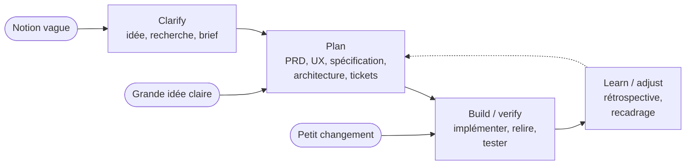
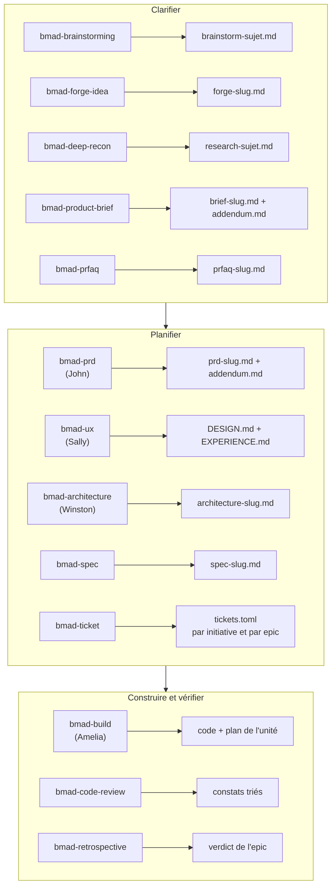
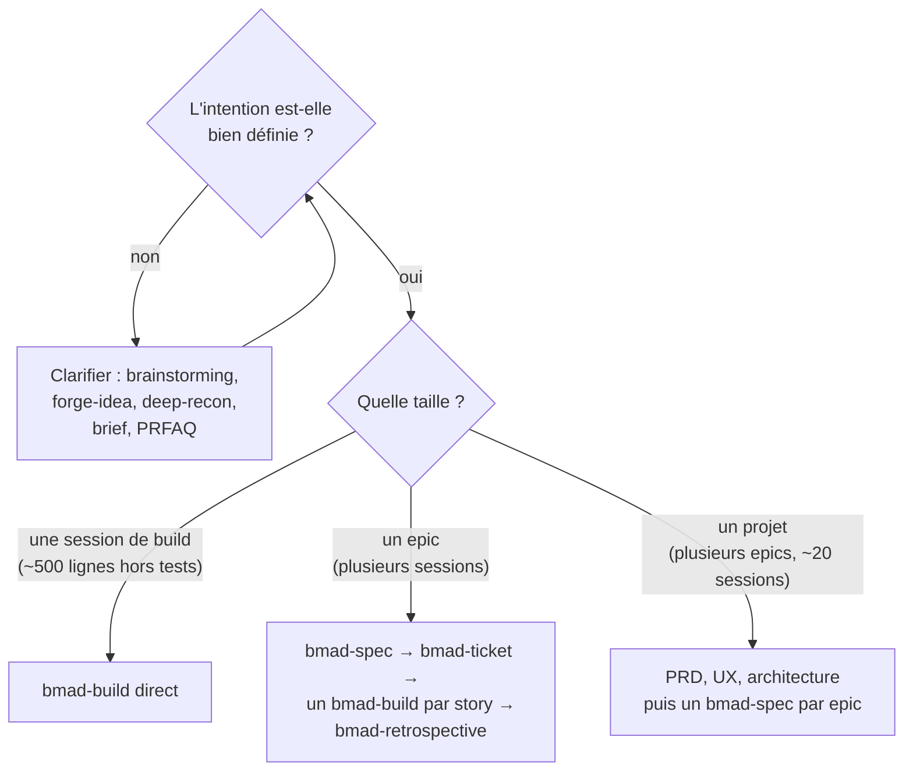

# BMAD - la méthode

## Aperçu

- **BMAD** (*BMad Method*) est une méthode de développement agile pilotée par IA, livrée sous forme de **skills** que l'on installe dans l'outil de codage (Claude Code, Cursor, Cline, Codex, Windsurf, Amp, Antigravity et d'autres). Elle ne code pas : elle cadre, spécifie, découpe, fait implémenter puis relire par l'agent hôte.
- Le README la définit par trois choses : les **décisions restent explicites**, le **contexte se reporte** d'une étape à la suivante, et le **processus se dimensionne** au travail. Un petit changement va droit à l'implémentation ; un chantier complexe reçoit la profondeur qu'il demande.
- Cette page explique **le principe**. La liste de chaque skill, agent et commande est dans [[BMAD - tour complet des skills]] ; l'outil lui-même (licence, installation, pièges) est la brique [[BMAD]].

> **État des sources au 2026-10-07.** Deux états coexistent. La dernière **release** est la v6.12.1 (2026-10-04, paquet npm `bmad-method`, installeur `npx bmad-method install`). La **branche `main`**, que décrivent le README et le site `docs.bmad-method.org`, porte une réorganisation non publiée : installation par la CLI de skills (`npx skills add`), skill concentrateur `bmad`, commandes `bmad setup` et `bmad status`, suivi du travail par `bmad-ticket`. Le principe ci-dessous vaut pour les deux ; quand un détail diffère, la page le dit. Cette installation par la CLI de skills n'a pas été rejouée ici.

## Concepts clés

### La boucle de livraison

Quatre temps, et **on entre là où le travail se trouve** (schéma du README) : une notion vague commence à *Clarify*, une grande idée claire à *Plan*, un petit changement à *Build & verify*. *Learn & adjust* referme la boucle vers *Plan* : ce qu'on apprend en construisant réécrit la spécification.

### Qui produit quoi

Cinq **agents nommés** portent un rôle (Mary l'analyste, John le chef de produit, Sally l'UX, Winston l'architecte, Amelia le développeur). Chacun est une identité qui lance des skills ; un skill peut aussi se lancer sans agent. **Chaque document a exactement un skill qui l'écrit**, d'où la règle de la doc : on corrige la source (le PRD, la spécification), jamais une copie en aval.

Les noms de fichiers sont ceux de la branche `main`. La release v6.12.1 écrit encore `SPEC.md` accompagné d'un `stories.yaml`, ainsi que des fichiers d'epics et un `sprint-status.yaml` (skills `bmad-create-epics-and-stories` et `bmad-sprint-planning`, absents de `main`, où `bmad-ticket` les remplace).

### La taille décide du chemin

La documentation pose une seule question : **l'intention est-elle déjà bien définie ?** Une intention bien définie dit ce qui doit être vrai à la fin, ce qui ne doit pas changer et ce qui est hors périmètre, assez pour que quelqu'un d'autre construise sans deviner. Si oui, on la donne à `bmad-spec`, qui la mouline à la taille du travail. Si non, on utilise les outils de clarification jusqu'à ce qu'elle le soit.

- **Une session** vaut environ 500 lignes ajoutées ou modifiées (tests exclus) dans une petite poignée de fichiers.
- **Un epic** est un résultat cohérent qui demande plusieurs sessions. Il se découpe en stories rangées dans l'ordre de construction.
- **Un projet** couvre plusieurs epics ou une vingtaine de sessions. Les documents partagés (PRD, UX, architecture) coordonnent, ils ne remplacent pas le build : chaque epic redevient une suite d'unités d'une session.
- Un **PRD** n'est nécessaire que si plusieurs personnes doivent s'accorder sur ce qu'est le produit, ou si plusieurs epics ne doivent pas diverger.

### L'unité de base : un build

Tout le reste répète cette unité. `bmad-build` prend n'importe quelle intention (une phrase, un ticket, un lien d'issue), **enquête dans le dépôt avant de poser des questions**, puis choisit le chemin le plus court sûr.

1. Il relève trois faits sur la conception : des **intentions non dites** que l'utilisateur remarquerait au résultat, des **actions irréversibles**, l'**empreinte** du changement.
2. Propre sur les trois : chemin léger, plan minimal et implémentation dans la même session. Sinon : plan écrit complet, avec chaque doute en question ouverte, à approuver avant tout code.
3. Il implémente, fait relire le résultat par des relecteurs indépendants, corrige ce qui relève du changement, **reporte le reste** dans `deferred-work.md`, et commite en local.
4. Il s'arrête au statut `built`. **Seul l'humain (ou un orchestrateur) marque le ticket terminé.**

Chaque build démarre dans une **conversation neuve** : réutiliser une session d'un autre flux mélange les contextes. La relecture a deux profondeurs : `quick` (un relecteur, par défaut dans le build) et `thorough` (plusieurs lentilles, par défaut dans `bmad-code-review`).

### Le contrat : la spécification et son architecture

`bmad-spec` écrit un contrat court en cinq champs : *Why*, *Capabilities* (chacune avec une intention et une condition de succès), *Constraints*, *Non-goals*, *Success signal*. Il **ne se retouche pas à la main** : on relance le skill avec le changement, ce qui garde les identifiants de capacité stables. `bmad-architecture` n'écrit que les décisions qui **entreraient en conflit si deux personnes les prenaient séparément** (style d'API, propriété des données partagées), pas la pile ni l'arborescence : le code en est propriétaire.

## En pratique

### Quand BMAD convient

- **Travail de plusieurs sessions** qui demande une trace : spécification, découpage, état de chaque story, verdict à la fin.
- **Code existant** : `bmad-build` lit le dépôt d'abord et suit les conventions qu'il y trouve ; `bmad-project-context` pose un bloc court et vérifié dans `AGENTS.md`.
- **Plusieurs agents ou plusieurs personnes** sur les mêmes décisions : la colonne vertébrale d'architecture et le PRD servent à ne pas diverger.
- **Contexte d'ESN ou d'industriel** : la chaîne produit des documents relisibles à des points de validation précis (verdict PRFAQ, validation du PRD, revue de l'architecture, approbation du découpage, verdict de rétrospective). Ils tiennent lieu de trace pour le client.

### Quand c'est trop lourd

- **Correctif évident** : la doc dit elle-même qu'on n'a pas besoin de BMAD pour une retouche triviale et sans risque.
- **Prototype jetable** : un prompt direct, ou `bmad-build` avec une ligne ; décider ensuite, **exprès**, de le jeter, de le garder (il devient du code existant) ou d'abandonner l'idée.
- **Intention floue** : `bmad-spec` ne sait pas dire ce qu'on veut. Entrée trop mince, il renvoie vers `bmad-prd` ; entrée trop grosse (au-delà de quelques dizaines de milliers de jetons), il perd en silence les parties qui comptaient : condenser d'abord.

### Pièges

- **Churn** : la v4 et la v6 sont incompatibles, et la v6 a renommé ses skills plusieurs fois (`bmad-quick-dev` devenu `bmad-build`, trois skills de recherche fondus en `bmad-deep-recon`). Les anciens noms subsistent en renvois. Verrouiller une version.
- **Ne pas répéter la relecture** : trois passes de relecture qui trouvent encore du fond disent que le défaut est **en amont** (conception faible, règles ambiguës), pas dans ce diff.
- **Relecteur sans intention** : `bmad-code-review` sans plan ni spécification ne juge que le diff contre lui-même. Lui passer la description de la PR ou le plan du ticket.
- **Garder les plans** : supprimer un plan remet une story terminée en « à faire » pour les builds suivants et la rétrospective.
- **Modèle et confidentialité** : BMAD n'impose pas de fournisseur, le modèle est celui de l'outil hôte. Leur compatibilité avec un modèle local n'a pas été vérifiée ici.

## Approches voisines & alternatives

### Parallèle avec Scrum

BMAD se dit « agile », mais ne reprend pas les cérémonies de Scrum. La correspondance est approximative :

| Scrum (Scrum Guide 2020) | BMAD |
|---|---|
| Product Backlog | PRD, spécification et `tickets.toml` (les stories, dans l'ordre de construction) |
| Sprint, durée fixe | pas de durée : l'unité est **une session de build**, bornée par sa taille |
| Product Owner | l'humain décide ; John (PM) l'aide à formuler le PRD |
| Scrum Master | pas de rôle : `bmad-ticket` tient l'ordre et le statut (l'agent `sm` de la v6 n'existe plus dans la v6.12.1) |
| Définition de terminé | critères d'acceptation du plan, revue, tests ; statut `built`, puis **l'humain** marque `done` |
| Sprint Review | `bmad-code-review` et `bmad-walkthrough` (relecture humaine guidée, bloc par bloc) |
| Sprint Retrospective | `bmad-retrospective`, **par epic**, qui lit les diffs, commits et plans et rend `accepted`, `accepted-with-open-items` ou `rejected` |

La différence de fond : Scrum découpe le **temps**, BMAD découpe le **travail** en unités qu'une session d'agent peut finir. Voir [[Backlog, Kanban, Scrum et Shape Up]].

### Parallèle avec le cycle de vie d'un projet assisté par agent

| Étape de [[Cycle de vie d'un projet assisté par agent]] | Skills BMAD |
|---|---|
| Cadrer | `bmad-brainstorming`, `bmad-forge-idea`, `bmad-deep-recon`, `bmad-product-brief`, `bmad-prfaq` |
| Spécifier | `bmad-prd`, `bmad-ux`, `bmad-spec`, `bmad-architecture` |
| Planifier | `bmad-ticket` (release v6.12.1 : `bmad-create-epics-and-stories`, `bmad-sprint-planning`) |
| Implémenter | `bmad-build`, `bmad-build-auto` |
| Vérifier | `bmad-code-review`, `bmad-qa-generate-e2e-tests`, `bmad-walkthrough`, `bmad-retrospective` |
| Documenter | `bmad-project-context` (consignes de l'agent) ; le skill de documentation de projet est dépassé |
| Livrer | hors champ : le build commite en local et propose une PR, rien sur les versions ni le déploiement |

### Autres pages

- [[BMAD - tour complet des skills]] — chaque skill, agent et commande, avec l'ordre d'emploi et une session complète.
- [[BMAD]] — la brique : licence, installation, version.
- [[Spec Kit]] — même étage, plus mince : constitution, spécification, plan, tâches, implémentation.
- [[OpenSpec]] — la spécification **dans le dépôt**, un dossier par changement, archivé une fois livré.
- [[Développement piloté par la spécification]] — la famille d'approches dont BMAD est la version la plus lourde.
- [[PRD et user stories]] — le contenu minimal d'un PRD et de critères d'acceptation.
- [[Revue, tests et définition de terminé avec un agent]] — la vérification qui ferme la chaîne.
- [[Boucle de Ralph]] — `bmad-loop`, module officiel à part, orchestre en Python une boucle choisir une story, implémenter, relire, vérifier, commiter, avec un contexte neuf à chaque étape.
- [[Fichiers de contexte pour agents]] — `bmad-project-context` écrit le bloc `AGENTS.md`.
- [[Branches courtes et worktrees pour agents]] — l'isolation de chaque story dans son worktree, que `bmad-loop` propose en option.
- [[Vibe coding contre ingénierie agentique]] — le contraste que BMAD revendique.
- En texte simple : **Agent OS** (`buildermethods/agent-os`, MIT, extrait et injecte les standards d'un dépôt et aide à façonner des spécifications), **Kiro** (AWS, propriétaire) et **Task Master** (MIT assorti d'une clause qui interdit de « vendre » le logiciel, y compris en hébergement ou en conseil : à écarter en ESN). Aucun n'a de fiche.

## Pour aller plus loin

- Documentation officielle : *Choose a Planning Path*, *Build a Change*, *Review a Change*, *Finish an Epic*, *Plan Inside an Organization* — `docs.bmad-method.org`, sections `plan/` et `build/` (consultées le 2026-10-07).
- Dépôt `bmad-code-org/BMAD-METHOD` : README et `CHANGELOG.md` (releases v6.11.0, v6.12.0 et v6.12.1 du 2026-10-04 ; une section « Unreleased » décrit la réorganisation).
- Licence MIT ; les marques BMad™, BMad Method™ et BMad Core™ appartiennent à BMad Code, LLC (fichiers `LICENSE` et `TRADEMARK.md`) : un dérivé doit changer de nom.
- Modules officiels (MIT chacun, dépôts `bmad-code-org/*`) : Builder, Creative Intelligence Suite, Test Architect, Loop, Game Dev Studio — voir [[BMAD - tour complet des skills]].
- *The Scrum Guide* (Schwaber et Sutherland, 2020), `scrumguides.org` : référence du tableau de parallèle.
