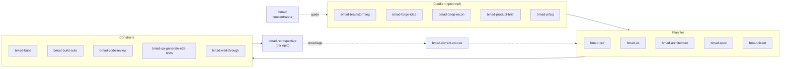
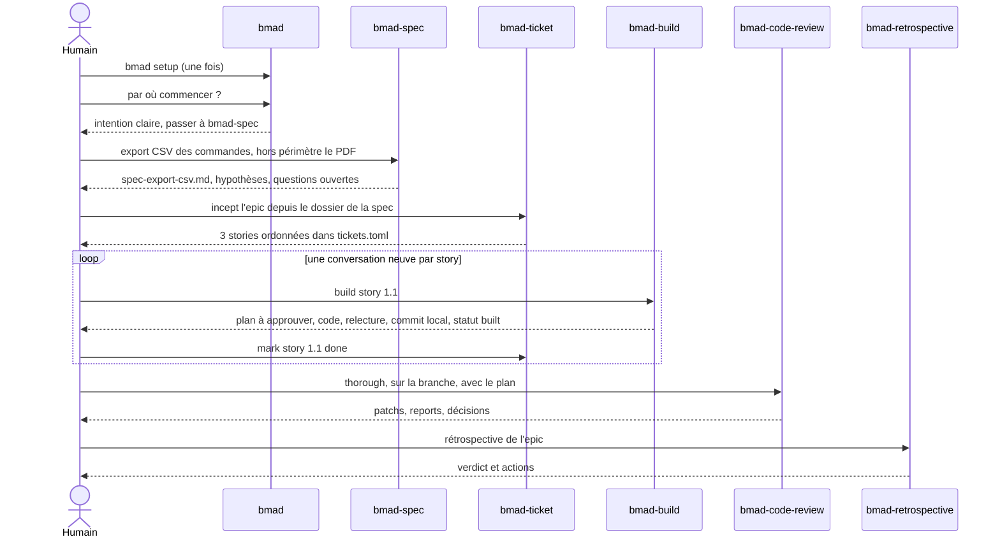

# BMAD - tour complet des skills

## Aperçu

- Un **skill** BMAD est une commande nommée que l'installeur dépose dans l'outil de codage : un dossier avec un `SKILL.md`, appelé par son nom (`bmad-build`, parfois précédé de `/` ou `$`). Il fait l'une de trois choses : charger un **agent** (une personnalité), lancer un **workflow** en plusieurs étapes, ou exécuter une **tâche** unique.
- Cette page est le **catalogue** : tout ce que la doc officielle liste, module par module, avec ce qu'on en tire et l'ordre d'emploi. Le principe, les phases et les rôles sont dans [[BMAD - la méthode]].
- Deux manières de démarrer un travail : taper le **nom du skill**, ou charger un agent puis taper un **code de menu** (`BD`, `CR`…) pour changer de tâche sans quitter le personnage. Les codes sont propres à chaque agent : `CR` est une analyse concurrentielle chez l'analyste, une revue de code chez le développeur.
- Les noms et le découpage décrits ici sont ceux de la branche `main` (documentation `docs.bmad-method.org` au 2026-10-07). La release v6.12.1 (2026-10-04) a un catalogue voisin mais pas identique : l'écart est dans la section *Release publiée et branche principale*.

## Concepts clés

### Les skills, du début à la fin d'un chantier



Aucun de ces blocs n'est obligatoire : la doc parle d'**outils indépendants, pas d'étapes**. Pour savoir lequel lancer, on demande au skill `bmad`.

### Le concentrateur : `bmad`

Répond aux questions sur BMAD et **recommande le skill suivant** d'après les dossiers déjà écrits dans l'initiative active. Il porte aussi les commandes d'installation :

| Commande | Effet |
|---|---|
| `bmad setup` | installe le socle (dossier `_bmad/`) et les scripts des modules ; met à jour (`npx skills update`), migre les noms renommés, propose de supprimer les skills retirés |
| `bmad status` | vérifie l'installation et les versions, nomme les skills des modules non installés |
| `bmad migrate method` | déplace un projet v6 vers la nouvelle organisation (documents, `epics.md`, `sprint-status.yaml`, stories) après avoir montré son plan |
| *initiative* | montrer, changer, créer ou vider l'initiative active |

### Les cinq agents du module BMad Method

Chaque agent est une **identité** (nom, rôle, principes, menu) qu'on peut surcharger ; ses codes de menu lancent les workflows.

| Agent | Skill | Codes | Ce qu'il fait |
|---|---|---|---|
| Mary, analyste | `bmad-agent-analyst` | `BP` `MR` `DR` `TR` `TS` `CR` `UV` `CB` `WB` `PC` | brainstorming ; recherches marché, domaine, technique ; choix de technologie ; analyse concurrentielle ; voix des utilisateurs ; brief ; défi PRFAQ ; contexte du projet |
| John, chef de produit | `bmad-agent-pm` | `PRD` `CC` `TK` | créer, mettre à jour ou valider un PRD ; recadrer ; planifier et suivre les tickets |
| Winston, architecte | `bmad-agent-architect` | `CA` `TK` | colonne vertébrale d'architecture ; planifier le travail et ses dépendances |
| Amelia, développeuse | `bmad-agent-dev` | `BD` `QA` `CR` `ER` `TK` | construire ; générer des tests ; revue de code ; rétrospective d'epic ; tickets |
| Sally, UX | `bmad-agent-ux-designer` | `CU` | conception UX |

La rédactrice technique (Paige) est en pause ; le contexte du projet vit dans le code `PC` de l'analyste ou dans `bmad-project-context`.

### Les skills centraux (module core, huit)

| Skill | Ce qu'il fait | Ce qu'il produit |
|---|---|---|
| `bmad` | concentrateur, voir plus haut | une réponse et les prochaines étapes |
| `bmad-advanced-elicitation` | seconde passe structurée sur la dernière sortie du modèle : propose cinq méthodes de raisonnement (pré-mortem, premiers principes, inversion, équipe rouge contre bleue, questionnement socratique…) ; on en choisit une, il réexamine | des améliorations à accepter ou rejeter |
| `bmad-review` | relit un diff, un document ou autre à travers des **lentilles** : adversariale, cas limites, trous de vérification (code), structure et prose (documents) ; zéro constat est un résultat valide | constats groupés par lentille, en JSON ou Markdown |
| `bmad-customize` | écrit et vérifie les surcharges d'un skill sans éditer de TOML à la main | un fichier sous `_bmad/custom/` |
| `bmad-brainstorming` | séance guidée vers plus de cent idées ; trois postures : facilitateur (aucune idée fournie), partenaire créatif, ou « idées à ma place » | `brainstorm.html` et un `brainstorm-sujet.md` |
| `bmad-deep-recon` | recherche d'aide à la décision, en trois modes (voir ci-dessous) | `research-sujet.md` cité |
| `bmad-forge-idea` | éprouve une idée à moitié formée par une question à la fois, avec des personas qui attaquent ses points faibles | `forge-report.html`, plus `forge-slug.md` si l'idée tient |
| `bmad-party-mode` | réunit les agents (ou des personas sur mesure) dans une même conversation | une discussion, aucun fichier |

**`bmad-deep-recon`** : *Draft* écrit l'invite à coller dans son outil de recherche approfondie ; *Process* range un rapport déjà fait et en tire un résumé cité ; *Run* fait la recherche sur place, avec des recherches web en parallèle et un seul point d'accord. Types : `market`, `domain`, `technical`, `competitive`, `user-voice`, `academic-lit`, plus *Select* pour départager des candidats.

**`bmad-forge-idea`** se termine de trois façons valides : *hardened* (l'idée est assez précise pour servir), *killed* (elle ne tient pas, le rapport dit pourquoi), *clearer* (on comprend mieux, rien à transmettre). « Attack this » et « defend this » changent la posture.

**`bmad-party-mode`** a quatre modes : `session` (un seul modèle joue tout le monde, par défaut), `auto`, `subagent` (un agent indépendant par persona, plus cher mais sans accord de façade), `agent-team` (Claude Code seulement). Deux groupes sont fournis : la *Code Review Crew* (sécurité, adversaire, cas limites, artisan, pragmatique) et l'*Anti-Consensus Club*. C'est un débat, pas une revue vérifiée.

### Les skills de planification (module BMad Method)

| Skill | Rôle | Sortie | Quand |
|---|---|---|---|
| `bmad-product-brief` | brief d'une à deux pages ; créer, mettre à jour ou valider | `brief-slug.md` + `addendum.md` | concept déjà clair, à écrire avant un PRD |
| `bmad-prfaq` | méthode *Working Backwards* d'Amazon : communiqué de presse du produit fini, puis FAQ clients et FAQ interne, puis verdict ; option `-H` sans conversation | PRFAQ + résumé court | éprouver un concept avant d'engager des moyens |
| `bmad-prd` | PRD par capacités, exigences fonctionnelles à identifiants stables, exigences non fonctionnelles à part ; trois intentions : *create*, *update*, *validate* | `prd-slug.md` + `addendum.md`, ou rapport de validation | plusieurs personnes doivent s'accorder sur le produit |
| `bmad-ux` | deux documents pairs : `DESIGN.md` (apparence) et `EXPERIENCE.md` (comportement, accessibilité, parcours) ; trois modes : rapide, accompagné, passation à un outil de design | les deux fichiers + `ux-slug.md` | interface dont l'apparence compte ; inutile pour du back-end |
| `bmad-spec` | condense n'importe quelle entrée en contrat court (*Why*, *Capabilities*, *Constraints*, *Non-goals*, *Success signal*) ; met à jour et valide | `spec-slug.md` + fichiers compagnons | toute intention bien définie, avant de construire |
| `bmad-architecture` | décisions qui garderaient cohérentes des parties construites séparément ; accompagné par défaut, ou rapide avec balises `[ASSUMPTION]` ; peut lire un code existant | `architecture-slug.md` | plusieurs epics ou agents indépendants |
| `bmad-ticket` | initiatives, epics, stories, bugs : `tickets.toml` ordonné, niveaux de découpage, suivi (voir ci-dessous) | arbre de tickets | une spécification d'epic, un PRD ou une simple idée à découper |
| `bmad-correct-course` | évalue un changement important en cours de route, exige un PRD ; sans PRD, on met la spécification à jour avec `bmad-spec` | `change-slug/change-slug.md` | une exigence, un choix d'architecture ou une dépendance bouge |
| `bmad-project-context` | installe, adopte, rafraîchit ou audite le bloc d'instructions de l'agent dans `AGENTS.md`, et note les erreurs observées | un bloc entre balises `bmad:context` | code existant, ou l'agent refait la même erreur |

**`bmad-ticket`** se pilote en langage naturel :

| On dit | Effet |
|---|---|
| « Split this initiative into epics » | propose des frontières d'epics et note l'ordre |
| « Incept the first epic » | planifie tout l'epic avec soi en stories ordonnées |
| « What's next? » | ce qui est prêt, en cours, bloqué |
| « Review the stories » | écrit le fichier de chaque story si besoin, puis l'améliore avec soi |
| « File a bug: … » | un ticket direct dans `backlog/`, sans epic |
| « Mark story 1.2 done » | seul moment où une story passe à `done` |

Le magasin par défaut est un dossier de fichiers Markdown (`_bmad-output`) ; Jira, Linear, GitHub Issues, Notion ou Trello sont des options encore peu testées d'après la doc, et rien ne se synchronise tout seul.

### Les skills de construction

| Skill | Rôle | Sortie |
|---|---|---|
| `bmad-build` | une intention (phrase, issue, ticket `2.3`, plan à relire) devient du code relu et vérifié, avec points d'arrêt humains | code, commit local, plan de l'unité |
| `bmad-build-auto` | **une** itération sans surveillance, pour un orchestrateur ; ne choisit jamais le ticket suivant | plan, code, statut terminal ; s'arrête `blocked` sans sous-agents |
| `bmad-code-review` | plusieurs relecteurs indépendants en parallèle, puis tri : *patch*, *defer*, *decision needed* ; peut s'appliquer à une PR, un commit, une branche | constats dans le plan, ou dans le chat |
| `bmad-walkthrough` | relecture **humaine** guidée, un bloc à la fois : intention, grandes lignes, tranches par sujet, périphérie | un récit de relecture et son journal |
| `bmad-qa-generate-e2e-tests` | tests d'API et de bout en bout simples pour du code déjà écrit (chemin nominal plus quelques erreurs), détecte le cadre de test | fichiers de tests + résumé |
| `bmad-retrospective` | juge un epic fini d'après les plans, diffs et commits ; chaque constat porte une source ; ne marque rien « terminé » | `epic-slug-retrospective.md`, verdict `accepted`, `accepted-with-open-items` ou `rejected` |

Les relectures de `bmad-walkthrough` offrent six gestes : pensées, second avis, revue formelle, test, conduite, clôture. Un build propose de créer une PR, de faire le walkthrough ou d'enchaîner.

### Les modules officiels, hors socle

Tous sous licence MIT (fichier `LICENSE` de chaque dépôt, copyright BMad Code, LLC).

| Module | Contenu | Remarque |
|---|---|---|
| **BMad Builder** (`bmad-builder`) | construire ses propres agents à mémoire, workflows et modules, puis les distribuer ; repose sur le standard ouvert Agent Skills | dans `main`, le dépôt principal absorbe ses fonctions sous le nom *Toolsmith*, annoncé comme un premier jet pour la v7 : un agent, Smithy (`bmad-toolsmith`), et `bmad-eval` qui mesure un skill ; les pages de doc correspondantes sont encore « en cours d'écriture » |
| **Creative Intelligence Suite** (CIS) | six agents (Carson, Maya, Dr. Quinn, Victor, Sophia, Caravaggio) : coach de brainstorming, design thinking, résolution créative de problèmes, stratégie d'innovation, narration, présentations | `bmad-cis-design-thinking`, `bmad-cis-problem-solving`, `bmad-cis-innovation-strategy`, `bmad-cis-storytelling` ; version 0.3.x, présentée par ses auteurs comme une démonstration technique du format de module |
| **Test Architect** (TEA) | un agent, Murat, et dix workflows : test design, cadre de test, intégration continue, tests d'acceptation d'abord, automatisation (`bmad-testarch-automate`, plus lourde que `bmad-qa-generate-e2e-tests`), revue de tests, audit de non-fonctionnel, traçabilité, évaluation, tutoriel ; priorités P0 à P3, décisions PASS, CONCERNS, FAIL, WAIVED ; barème de revue calculé, pas jugé | Playwright, Cypress, Pact, pytest, k6 cités comme cibles |
| **BMad Loop** (`bmad-loop`) | orchestrateur **en Python pur**, sans LLM dans la boucle de contrôle : choisir une story, implémenter, relire, vérifier, commiter, chaque étape dans une session d'agent neuve (tmux) ; `bmad-loop init`, `validate`, `run`, `sweep`, `tui` | « bêta ouverte précoce », v0.13.1 (2026-10-01), changements cassants possibles ; Python 3.11 ou plus, git 2.34 ou plus, Linux, macOS ou WSL ; exige BMAD 6.10.0 ou plus |
| **Game Dev Studio** (`bmgd`) | documents de conception de jeu, narration, UX, architecture, production par epics, prototypage rapide ; Unity, Unreal, Godot, Roblox ou moteur maison | ne produit ni art, ni animation, ni son |

### Installation et outils compatibles

Deux voies sur la branche `main` ; elles ne se mélangent pas pour un même skill :

```bash
npx skills add bmad-code-org/BMAD-METHOD          # CLI de skills (Node.js, npm, Git)
npx skills add bmad-code-org/BMAD-METHOD --skill bmad --skill bmod-core-tools --skill bmod-method --skill bmad-build --skill bmad-ticket
```

```text
/plugin marketplace add bmad-code-org/bmad-plugins        # dans Claude Code
codex plugin marketplace add bmad-code-org/bmad-plugins   # dans un terminal, pour Codex
```

Puis, dans l'outil ouvert sur le projet : demander au skill `bmad` de lancer `bmad setup`, puis appeler `bmad-build` avec ce qu'on veut changer. Prérequis : `uv` (setup et scripts Python), Node.js, npm et Git pour la CLI de skills, un outil de codage qui gère les skills.

| Outil | Dossier des skills |
|---|---|
| Claude Code | `.claude/skills/` |
| Cursor, Windsurf, Codex, Auggie, Amp et la plupart des autres | `.agents/skills/` |
| Cline | `.cline/skills/` |
| IBM Bob | `.bob/skills/` |
| Antigravity | `.agent/skills/` |
| AdaL | `.adal/skills/` |

La **surcharge** se fait sans toucher aux fichiers livrés : `_bmad/custom/<skill>.toml` (équipe, versionné) et `<skill>.user.toml` (perso, ignoré par git) ; le plus personnel gagne. Les tableaux dont chaque entrée a un `code` ou un `id` fusionnent par clé, les autres s'ajoutent ; **aucune surcharge ne retire** un élément livré. Recettes de la doc : un fait que l'agent garde en tête (`persistent_facts`), un crochet de fin (`on_complete`, par exemple publier sur Confluence), un gabarit de document à soi.

### Release publiée et branche principale

| | v6.12.1 (npm, 2026-10-04) | `main` (non publié) |
|---|---|---|
| Installation | `npx bmad-method install` | `npx skills add …` puis `bmad setup` |
| Guide | `bmad-help` | `bmad` |
| Planifier le travail | `bmad-create-epics-and-stories`, `bmad-sprint-planning` (`sprint-status.yaml`) | `bmad-ticket` (`tickets.toml`) |
| Spécification | `SPEC.md`, découpage en `stories.yaml` | `spec-slug.md` ; le découpage passe par `bmad-ticket` |
| Menus d'agents | PM : `PRD` `CE` `IR` `CC` ; dev : `BD` `QA` `CR` `SP` `ER` | PM : `PRD` `CC` `TK` ; dev : `BD` `QA` `CR` `ER` `TK` |
| Sortie | `planning-artifacts` et `implementation-artifacts` | dossier `_bmad-output`, sous `initiative-slug/` |
| Inchangés | `bmad-build`, `bmad-build-auto`, `bmad-code-review`, `bmad-retrospective`, `bmad-walkthrough`, `bmad-prd`, `bmad-architecture`, `bmad-ux`, `bmad-product-brief`, `bmad-prfaq`, `bmad-project-context`, skills centraux | idem |

Anciens noms qui renvoient encore au skill courant : `bmad-quick-dev` (maintenant `bmad-build`), `bmad-dev-auto`, `bmad-create-prd`, `bmad-edit-prd`, `bmad-validate-prd`, `bmad-market-research`, `bmad-generate-project-context`, `bmad-document-project`, `bmad-checkpoint-preview` (maintenant `bmad-walkthrough`). Depuis la v6.12.0, l'installeur npm ne dépose ces renvois que sur demande (option `--shims`).

## En pratique

### Je veux faire X, j'utilise Y

| Je veux… | J'utilise |
|---|---|
| savoir par où commencer, ou quoi faire ensuite | `bmad` |
| trouver des idées sur un sujet | `bmad-brainstorming` |
| savoir si mon idée tient | `bmad-forge-idea` |
| appuyer une décision sur des faits (marché, techno, concurrents) | `bmad-deep-recon` |
| écrire ma conviction sur une page | `bmad-product-brief` |
| éprouver un concept côté client | `bmad-prfaq` |
| faire valider ce qu'est le produit par plusieurs personnes | `bmad-prd` |
| décrire l'apparence et le comportement d'une interface | `bmad-ux` |
| figer les décisions qui évitent que des parties divergent | `bmad-architecture` |
| un contrat court avant de construire | `bmad-spec` |
| découper un epic en stories, voir ce qui est prêt | `bmad-ticket` |
| faire un changement, petit ou moyen, d'une session | `bmad-build` |
| lancer une story sans surveillance | `bmad-build-auto` |
| relire une PR ou une branche | `bmad-code-review` |
| relire moi-même un changement, guidé | `bmad-walkthrough` |
| des tests de bout en bout sur du code fini | `bmad-qa-generate-e2e-tests` (simple), TEA (lourd) |
| clore un epic et décider de sa suite | `bmad-retrospective` |
| un changement de cap en plein chantier | `bmad-correct-course` |
| donner à l'agent les règles du dépôt | `bmad-project-context` |
| approfondir une réponse qui me semble superficielle | `bmad-advanced-elicitation` (commencer par un pré-mortem) |
| faire débattre plusieurs rôles | `bmad-party-mode` |
| changer le comportement d'un agent ou d'un workflow | `bmad-customize` |
| écrire mes propres skills ou agents | Builder, ou Toolsmith (`bmad-toolsmith`) |
| enchaîner les stories d'un epic sans moi | `bmad-loop`, ou une session d'agent qui lance un `bmad-build-auto` par ticket |

### Une session de bout en bout

Exemple **construit à partir des pages de la doc**, pas une session enregistrée : ajouter un export CSV à une appli existante, en solo.



1. **Une fois** : installer les skills, ouvrir l'outil dans le dépôt, demander `bmad setup`. Sur du code existant, lancer `bmad-project-context` pour poser les règles dans `AGENTS.md`.
2. **Cadrer** : l'intention est claire, donc pas de brainstorming. Donner à `bmad-spec` la demande en quelques lignes, **hors périmètre compris** ; relire ses hypothèses et ses questions ouvertes.
3. **Découper** : `bmad-ticket` sur le dossier de la spécification, accepter ou réordonner les stories ; repérer celles qui fixent un motif pour la suite.
4. **Construire** : pour chaque story, **conversation neuve**, `bmad-build 1.1`. Approuver le plan quand il est écrit ; les stories fondatrices en `bmad-build`, les répétitions éventuellement en `bmad-build-auto`.
5. **Fermer** : après toutes les stories, `bmad-code-review` en `thorough` sur la branche, puis `bmad-retrospective`. Un verdict `accepted-with-open-items` donne des actions à transformer en tickets.

## Approches voisines & alternatives

- [[BMAD - la méthode]] — le principe, la boucle, les rôles, Scrum en parallèle.
- [[BMAD]] — la brique : licence MIT et clause de marque, installation, version.
- [[Agent skills]] — le mécanisme `SKILL.md` que BMAD utilise ; le standard ouvert Agent Skills.
- [[Spec Kit]] et [[OpenSpec]] — la même idée de spécification d'abord, avec beaucoup moins de skills.
- [[Développement piloté par la spécification]], [[Cycle de vie d'un projet assisté par agent]], [[Backlog, Kanban, Scrum et Shape Up]] — les méthodes dont BMAD est une réalisation outillée.
- [[Boucle de Ralph]] — le principe de `bmad-loop`.
- [[Revue, tests et définition de terminé avec un agent]] — ce que couvrent `bmad-code-review` et `bmad-qa-generate-e2e-tests`.
- [[Fichiers de contexte pour agents]] — `bmad-project-context` et le bloc `AGENTS.md`.
- [[Multi-agent systems]] — ce que `bmad-party-mode` simule (un modèle, plusieurs voix) ou réalise (`subagent`, `agent-team`).

## Pour aller plus loin

- Référence officielle : *Skills and Agents*, `docs.bmad-method.org/reference/skills-and-agents/` (consultée le 2026-10-07) ; pages *Choose a Planning Path*, *Build a Change*, *Review a Change*, *Break Work into Stories and Track It*, *Customize BMad*, *Run Multi-Agent Discussions*, *Add Modules*.
- Dépôt `bmad-code-org/BMAD-METHOD` : dossier `skills/` (un `SKILL.md` par skill) et `CHANGELOG.md`.
- Dépôts des modules : `bmad-builder`, `bmad-module-creative-intelligence-suite`, `bmad-method-test-architecture-enterprise`, `bmad-loop`, `bmad-module-game-dev-studio`, tous sous `bmad-code-org`.
- Les noms de skills de CIS et de TEA, hors `bmad-testarch-automate`, sont donnés par leurs README, non confrontés à une installation.
