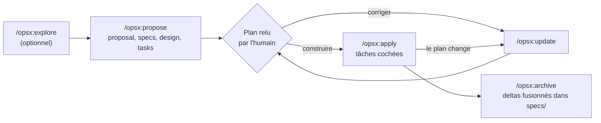

# OpenSpec

<!-- AUTO:BANDEAU:START -->
> Outil libre (MIT, TypeScript, paquet npm `@fission-ai/openspec`) de spécification dans le dépôt : un dossier `openspec/` garde les specs de ce qui est vrai et un dossier par changement (proposition, specs en delta, design, tâches) que l'agent de code rédige, implémente puis archive.

| Nature | Licence | Exécution | Maturité | Fraîcheur |
|---|---|---|---|---|
| Extension TypeScript | open-source | dans le moteur hôte, rien à héberger | — | amont non sondé |
<!-- AUTO:BANDEAU:END -->

## Définition

OpenSpec est un **outil en ligne de commande** (paquet npm `@fission-ai/openspec`) qui installe dans un agent de code des **commandes et des skills** pour travailler *spécification d'abord* : on décrit un changement, l'agent rédige le plan, l'humain le relit, puis l'agent construit. Tout vit en Markdown dans le dépôt, sous `openspec/`. Le README résume l'idée en cinq mots : *agree first, then build confidently*.

Le modèle tient en deux dossiers :

- `openspec/specs/` : **ce qui est vrai maintenant**, par domaine (`auth/`, `payments/`…), en exigences (« le système DOIT expirer une session après 30 minutes ») et en scénarios donné / quand / alors.
- `openspec/changes/` : **ce qu'on propose**, un dossier par changement, avec `proposal.md` (pourquoi), des specs en **delta**, `design.md` (comment) et `tasks.md` (la liste à cocher).

Un **delta** ne réécrit pas la spec entière : il déclare `ADDED`, `MODIFIED` ou `REMOVED` pour chaque exigence touchée. C'est ce qui permet de spécifier un changement dans une base de code de 50 000 lignes sans la documenter d'abord. À l'**archivage**, les deltas se fusionnent dans `specs/` et le dossier du changement part dans `changes/archive/` avec la date.

Le flux par défaut (profil `core`) compte six commandes : `propose`, `explore`, `apply`, `update`, `sync`, `archive`. Un profil étendu ajoute `new`, `continue`, `ff`, `verify`, `bulk-archive`, `onboard` (`openspec config profile`, puis `openspec update`). Les artefacts sont des **enablers, pas des portes** : on rouvre `design.md` en plein build si le design était faux.

## Prendre si / Écarter si

| Prendre si | Écarter si |
|---|---|
| Du code **existant** à faire évoluer : les deltas évitent de spécifier tout le système avant le premier changement | Correctif d'une ligne : la doc (*Core Concepts*) reconnaît que la cérémonie peut ne rien rapporter à ce niveau |
| Relire le **plan** en pull request, avec le code : la spec et le diff voyagent dans la même branche | Il faut des rôles nommés, un PRD signé et un suivi des stories : c'est l'étage de [[BMAD]], pas d'OpenSpec |
| Plusieurs agents de code dans l'équipe : plus de trente outils pris en charge, chacun reçoit ses commandes ou ses skills | Une chaîne d'outils qu'on veut figée : le projet sort des versions chaque semaine (v1.14.1 le 2026-10-06, v1.14.0 le 2026-09-30) et a déjà changé de flux une fois |
| Repartir d'un contexte vide : le plan est en fichiers, une nouvelle session reprend à `/opsx:apply` | Un poste sans accès réseau sortant : la télémétrie anonyme est active par défaut (voir *Exécution*) |
| Une planification qui touche plusieurs dépôts : les *stores* (bêta) mettent le plan dans un dépôt à part | Compter sur les *stores* en production : la doc les dit en bêta, avec des noms de commandes et des formats susceptibles de changer |

## Mise en œuvre

- Installation — `npm install -g @fission-ai/openspec@latest` (Node.js 20.19.0 ou plus), ou `brew install openspec` ; aussi pnpm, yarn, bun et Nix d'après le README
- Point d'entrée — `openspec init` dans le dépôt : crée `openspec/` et écrit, pour chaque outil choisi, ses commandes et ses skills (`--tools claude,cursor`, `all`, `none` pour les scripts). Ensuite, **dans le chat de l'agent, pas dans le terminal** : `/opsx:explore`, `/opsx:propose ajouter-le-mode-sombre`, `/opsx:apply`, `/opsx:archive` ; l'écriture dépend de l'outil : `/opsx-propose` (Cursor, GitHub Copilot), `@opsx-propose` (Amazon Q), `$openspec-propose` (Codex). La CLI sert à l'échafaudage, au suivi et à la vérification : `openspec list`, `view`, `show`, `validate`, `status`, `archive`, `config`
- Prérequis — Node.js 20.19.0 ou plus ; un agent de code pris en charge (la doc en liste plus de trente) ; OpenSpec ne touche jamais à git : il lit et écrit du Markdown, on commite `openspec/` comme le code
- Exécution — sur le poste, sans service à héberger ; les modèles sont ceux des agents. Réglages dans `openspec/config.yaml` (contexte du projet, règles par artefact) et schémas de flux sur mesure. **Télémétrie** : statistiques anonymes (nom de commande et version), actives tant qu'on ne les coupe pas — `openspec config set telemetry.enabled false`, ou `OPENSPEC_TELEMETRY=0`, ou `DO_NOT_TRACK=1` ; coupées d'office en CI ; la vérification de version de `openspec update` interroge le registre npm
- Coût — gratuit (MIT) ; la dépense est celle du modèle de l'agent piloté

## Écosystème

### Alternatives

- [[BMAD]] — Framework de développement piloté par agents (MIT avec clause de marque, npm `bmad-method`) : installe dans Claude Code ou Cursor un jeu d'agents nommés — analyst, PM, architect, dev, UX, scrum master, test architect — et le flux brief → PRD → architecture → implémentation story par story. — l'étage au-dessus : cadrage, PRD, architecture et suivi des stories, pour le prix de dizaines de skills (les noms et le périmètre à jour sont dans [[BMAD - tour complet des skills]]).
- voisin : [[Spec Kit]] — le même principe côté GitHub : une spécification exécutable pilote l'agent par étapes (constitution, spécification, plan, tâches). Il part d'une **fonctionnalité** à spécifier ; OpenSpec part d'un **changement** à archiver, ce qui le rend plus naturel sur du code existant.
- Voisins : [[Agent OS]] (MIT) extrait les standards d'un dépôt et les injecte dans les spécifications ; **Kiro** (AWS) est un éditeur propriétaire dont les specs sont `requirements.md`, `design.md` et `tasks.md` ; **Task Master** (MIT assorti d'une clause qui interdit de vendre le logiciel, y compris en hébergement ou en conseil) est un gestionnaire de tâches pour le développement piloté par IA, qui part d'un PRD. [[Agent OS]] a une fiche ; Kiro et Task Master n'en ont pas : propriétaire ou clause restrictive.

## Ressources

- Documentation — https://github.com/Fission-AI/OpenSpec/blob/main/docs/README.md
- Dépôt — https://github.com/Fission-AI/OpenSpec (licence MIT vérifiée dans le fichier `LICENSE`, dernier push le 2026-10-07) ; site https://openspec.dev/

## Voir aussi

- [[Agents de code]] — le hub du dossier
- [[Comparatif - Assistants de code IA]] — ce qui départage les briques du dossier
- [[BMAD - la méthode]] — le cadre complet auquel OpenSpec s'oppose par sa légèreté
- [[Développement piloté par la spécification]] — la famille d'approches, et la critique de son surcoût
- [[Agent skills]] — le mécanisme des skills que `openspec init` installe
