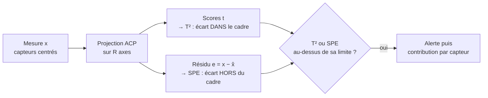

# T² et SPE

## Aperçu

- $T^2$ et SPE sont les **deux indicateurs classiques** pour surveiller un procédé industriel avec beaucoup de capteurs. On apprend d'abord à quoi ressemble le fonctionnement normal avec une [[PCA]], puis on suit, à chaque instant, deux nombres : $T^2$ (le point est-il **extrême dans le cadre habituel** ?) et SPE (le point **sort-il du cadre** ?).
- Exemple de compresseur à six capteurs : quand la charge monte, pression, courant et température montent **ensemble**, comme d'habitude. Ce mouvement sort des valeurs moyennes mais reste dans le cadre appris : $T^2$ grimpe, SPE reste bas. Si la température du palier monte alors que la charge n'a pas bougé, la **relation entre capteurs est cassée** : SPE grimpe, alors que $T^2$ peut rester bas.
- La page est la porte d'entrée. Le principe général des cartes est dans [[Contrôle statistique de procédé (SPC)]], la recherche du capteur fautif dans [[Expliquer une anomalie (contribution des capteurs)]], l'usage pour prévoir les pannes dans [[Maintenance prédictive et RUL]].

## Concepts clés

### Un cadre appris, et deux manières d'en sortir

- **Le cadre** est le sous-espace des $R$ premières composantes de l'ACP, ajusté sur des données **normales**. Il résume les corrélations habituelles entre capteurs.
- **$T^2$** mesure à quel point le point est loin du centre **à l'intérieur** de ce cadre, en unités de dispersion normale de chaque axe. Un grand $T^2$ : « fonctionnement inhabituel, mais cohérent avec les corrélations apprises » (régime de charge rare, démarrage).
- **SPE** (ou statistique $Q$) mesure la **distance au cadre**, ce que l'ACP ne sait pas reconstruire. Un grand SPE : « une relation entre capteurs a changé » (capteur dérivé ou bloqué, défaut physique nouveau).
- Les deux sont **complémentaires** : un défaut peut ne déplacer que l'un. Surveiller l'un sans l'autre rate une moitié des cas.

### Les limites de contrôle

- **$T^2$** : sous des hypothèses gaussiennes, la limite vient d'une loi de Fisher qui dépend du nombre $R$ de composantes et du nombre $n$ d'observations d'apprentissage (formule plus bas).
- **SPE** : la limite est une approximation due à Jackson et Mudholkar (1979), calculée à partir des valeurs propres **non retenues**. La formule n'est pas reproduite ici : la page de documentation lue (Eigenvector, `jmlimit`) renvoie au texte d'origine et à l'ouvrage de Jackson (1991).
- Deux cartes veulent deux limites : le taux de fausses alertes global est la combinaison des deux. Qin (2003) décrit des indices **combinés** qui fusionnent les deux en un seul (texte non relu).

### Après l'alerte : qui est fautif ?

- Un graphique de **contributions** décompose la valeur de $T^2$ ou de SPE en une part par capteur. Les capteurs corrélés avec le capteur fautif héritent d'une partie du signal (« bavure »), ce qui peut désigner un faux coupable. Le sujet est traité en détail dans [[Expliquer une anomalie (contribution des capteurs)]].

## Les maths, simplement

- Avec $x$ centré, $P$ la matrice des $R$ axes retenus, $t=P^\top x$ les scores et $\lambda_1,\dots,\lambda_R$ leurs variances :
  - $T^2=\sum_{a=1}^{R}\dfrac{t_a^2}{\lambda_a}$ : la **distance de Mahalanobis** dans l'espace des scores (voir [[Distance de Mahalanobis]]). Chaque score est ramené à sa variance normale avant d'être additionné.
  - $\mathrm{SPE}=\lVert x-PP^\top x\rVert^2$ : la **norme au carré du résidu**, c'est-à-dire de ce que les $R$ axes ne reconstruisent pas.
- Limite de $T^2$ pour une ACP à $R$ composantes ajustée sur $n$ observations : $T^2_{\mathrm{lim}}=\dfrac{R\,(n-1)(n+1)}{n\,(n-R)}\,F_{1-\alpha;\,R,\,n-R}$ (forme donnée par le cours en ligne de learnche.org, section sur le $T^2$ de Hotelling, lu).
- **Exemple** (raisonnement de cette page). Capteurs de charge corrélés à 0,95 : un point où ils montent tous deux de 3 écarts-types a un $T^2$ élevé et un SPE faible (même direction que la corrélation). Un point où l'un monte de 3 et l'autre baisse de 3 a un SPE très élevé : il est **orthogonal** au cadre.

## En pratique

- **Ajuster sur du normal, un régime à la fois.** L'ACP doit être apprise sur une période saine et propre. Plusieurs régimes de marche demandent un modèle par régime ; sinon $T^2$ prend le changement de régime pour une anomalie.
- **Choisir $R$.** Trop peu de composantes : SPE trop gros en marche normale. Trop : le modèle absorbe aussi le bruit et le défaut passe dans $T^2$. Une validation croisée ou le pourcentage de variance expliquée sert de point de départ.
- **Reprendre les données.** Capteurs au même pas, centrés et réduits avec les moyennes **d'apprentissage** (jamais recalculées sur les données testées).
- **Séries autocorrélées** : les limites supposent des lignes indépendantes, ce qui est faux pour des capteurs échantillonnés vite. Les limites calculées perdent leur sens et les fausses alertes peuvent se multiplier. Voir *Les limites sous autocorrélation* dans [[Contrôle statistique de procédé (SPC)]].
- **Non-linéarités** : une ACP linéaire ne suffit pas toujours. Les autoencodeurs reprennent l'idée (erreur de reconstruction à la place du SPE) : [[Anomalies multivariées par apprentissage profond]].
- **Un indicateur de santé.** $T^2$ ou SPE suivis dans le temps peuvent nourrir un indicateur de santé ([[Indicateurs de santé]]), avec un seuil d'alerte réglé selon [[Score et seuil d'alerte]].

## Approches voisines & alternatives

- [[Contrôle statistique de procédé (SPC)]] — les cartes de contrôle à une variable, dont celles-ci sont la version multivariée.
- [[Distance de Mahalanobis]] — $T^2$ en est le cas particulier dans le sous-espace de l'ACP.
- [[PCA]] — le modèle qui définit le cadre.
- [[Expliquer une anomalie (contribution des capteurs)]] — de l'alerte au capteur responsable.
- [[Détection d'outliers multivariée]] — d'autres détecteurs (LOF, Isolation Forest) quand l'hypothèse gaussienne ne tient pas.
- [[Maintenance prédictive et RUL]] et [[Surveillance conditionnelle et modes de défaillance]] — où ces indicateurs surveillent des machines tournantes.

## Pour aller plus loin

- Jackson, Mudholkar (1979), *Control Procedures for Residuals Associated With Principal Component Analysis*, Technometrics 21(3), 341-349 (résumé confirmé par recherche, texte non relu).
- Kourti, MacGregor (1995), *Process analysis, monitoring and diagnosis, using multivariate projection methods*, Chemometrics and Intelligent Laboratory Systems 28, 3-21 (résumé lu : PCA/PLS pour la surveillance de procédés continus et batch) : https://literature.learnche.org/item/31/process-analysis-monitoring-and-diagnosis-using-multivariate-projection-methods
- Qin (2003), *Statistical process monitoring: basics and beyond*, Journal of Chemometrics 17(8-9), 480-502 (résumé lu : indices SPE, $T^2$ et combinés, reconstruction de défauts).
- Hotelling (1931), *The generalization of Student's ratio*, Annals of Mathematical Statistics 2(3), 360-378 (référence confirmée par recherche, texte non relu).
- Cours en ligne learnche.org, section *Hotelling's T²* (limite de $T^2$ pour une ACP, lue) : https://learnche.org/pid/latent-variable-modelling/principal-component-analysis/hotellings-t2-statistic.html
- Westerhuis, Gurden, Smilde (2000), contribution plots généralisés, cités depuis [[Expliquer une anomalie (contribution des capteurs)]].
