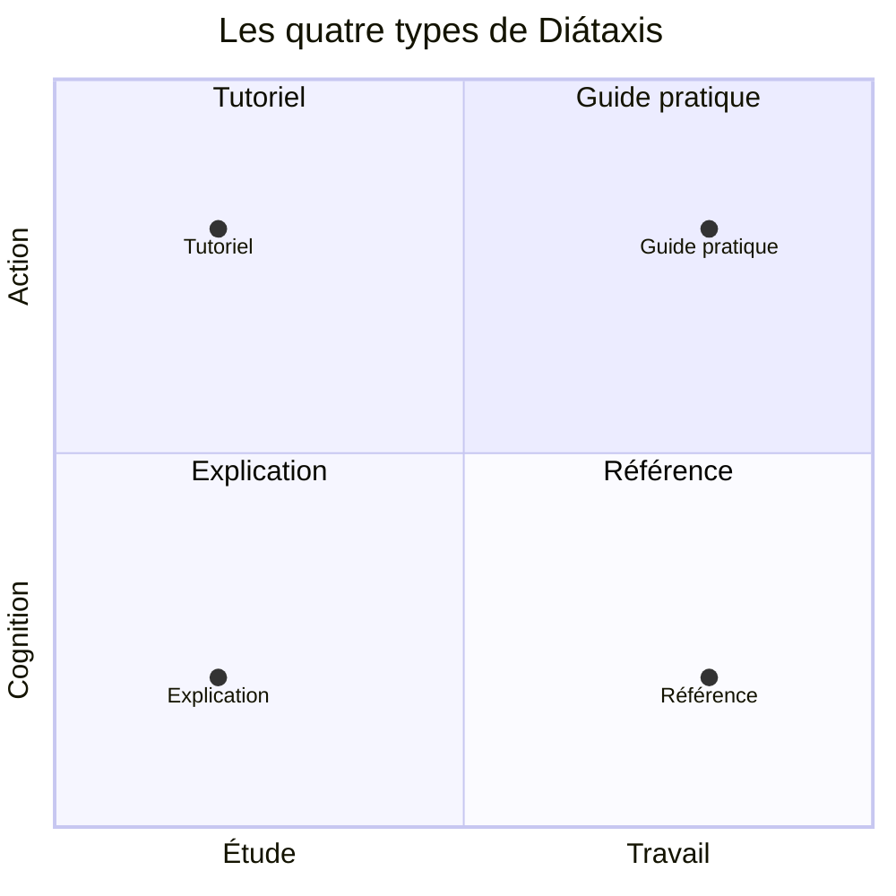
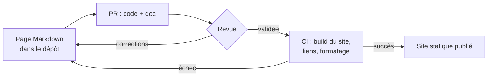

# Diátaxis et docs-as-code

## Aperçu

- **Diátaxis** (Daniele Procida) est un cadre pour organiser une documentation technique en **quatre types de pages**, chacun répondant à un besoin différent : tutoriel, guide pratique, référence, explication.
- **Docs-as-code** est l'autre moitié : écrire la documentation **avec les outils du code** (texte brut, git, revue, tests automatisés, publication par la CI).
- Diátaxis dit **quoi écrire et où le ranger** ; docs-as-code dit **comment le fabriquer et le garder à jour**. Les deux se complètent et ne dépendent d'aucun outil précis.

## Concepts clés

### Les quatre types

Le principe central : il existe quatre sortes de documentation, qui répondent à quatre besoins, et **chacune s'écrit différemment**. Les mélanger est la cause la plus courante de documentation illisible.

| Type | Besoin | Forme | Exemple |
|---|---|---|---|
| **Tutoriel** | apprendre en faisant | une leçon guidée, pas à pas, avec un résultat concret | « Créons un premier pipeline » |
| **Guide pratique** (how-to) | accomplir une tâche réelle | des directions pour un utilisateur déjà compétent | « Configurer la reconnexion » |
| **Référence** | consulter un fait | description neutre, exacte, complète, structurée comme le produit | liste des options d'une CLI |
| **Explication** | comprendre | discussion qui donne contexte et raisons, répond à « pourquoi ? » | « Pourquoi ce choix de stockage » |

Deux axes organisent la carte : **action contre cognition** (on fait, ou on sait) et **étude contre travail** (on acquiert une compétence, ou on l'applique).

Le tutoriel est une **leçon** : l'apprenant apprend par ce qu'il fait, et le rédacteur est responsable de sa réussite. Le guide pratique suppose au contraire un lecteur qui sait déjà : un tutoriel qui s'écarte pour offrir des options, ou un guide qui explique les bases, rate sa cible. La référence est neutre : elle décrit, sans dire quoi faire. L'explication se lit « loin du produit », après coup.

### Docs-as-code

Write the Docs résume : écrire la documentation avec les mêmes outils que le code. Concrètement :

- **Texte brut** (Markdown, reStructuredText, AsciiDoc), versionné dans le dépôt, à côté du code qu'il décrit.
- **Revue** : une modification de comportement et sa doc partent dans la même PR. Le merge peut être bloqué sans documentation.
- **Tests automatisés** : la CI construit le site, vérifie les liens, contrôle le formatage.
- **Publication** par la CI vers un site statique.

## En pratique

- **Classer les pages existantes avant d'en écrire de nouvelles** : chaque page tombe dans une case, ou doit être coupée en deux. Un README qui contient un tutoriel, un guide et la liste des options est trois pages.
- Quatre dossiers (`tutoriels/`, `guides/`, `reference/`, `explications/`) suffisent. Les **ADR** ([[ADR et design docs]]) et les schémas [[Modèle C4]] relèvent de l'explication.
- **La référence se génère** quand c'est possible (docstrings, schéma d'API, `--help`) : écrite à la main, elle diverge du code. Tutoriels et guides se réécrivent à la main et se **testent** : un tutoriel dont les commandes ne tournent plus est pire que pas de tutoriel.
- **Diagrammes en texte** : [[Mermaid]] est rendu nativement par [[Obsidian]] (bloc de code `mermaid`) et par GitHub, et se relit dans la PR comme du code. Pour un dessin libre, [[Excalidraw]] ou [[draw.io]] stockent un fichier à versionner.
- **CI** : construire le site et échouer sur lien cassé ou avertissement suffit à tenir la doc ; tâche réalisable dans [[GitHub Actions]], [[GitLab CE]], [[Forgejo]] ou [[Woodpecker CI]]. Sur un site sans accès à internet, le site statique se sert depuis n'importe quel serveur web interne. Un [[pre-commit]] peut vérifier le format localement avant le push.
- **Un coffre Obsidian est déjà docs-as-code** : Markdown, liens, git. La limite est l'inverse : les wikilinks (double crochet) ne sont pas du Markdown standard, et un générateur de site doit les comprendre ou les convertir.
- **Avec des agents** : séparer les types rend le contexte plus économe : l'agent charge la référence pour écrire du code et l'explication pour comprendre un choix. Il rédige un brouillon de guide ou de référence ; les tutoriels demandent d'**exécuter** chaque étape, sinon il invente des commandes plausibles. Voir [[Fichiers de contexte pour agents]] pour la partie destinée à l'agent.
- Pièges : transformer Diátaxis en chantier de refonte totale (la page *Start here* recommande l'inverse : l'appliquer à un problème précis, même petit, sans tout lire d'abord) ; documenter pour documenter ; publier sans CI, donc sans détection des liens morts ; confondre README et documentation.

## Approches voisines & alternatives

- [[ADR et design docs]] — une décision d'architecture est une page d'*explication*, rangée dans le dépôt.
- [[Modèle C4]] — les schémas de niveau 1 et 2 illustrent les pages d'explication.
- [[Mermaid]] — le diagramme en texte, rendu par GitHub et Obsidian.
- [[Obsidian]] — éditeur de notes Markdown ; ce coffre en est un exemple de docs-as-code.
- [[Fichiers de contexte pour agents]] — la documentation lue par l'agent plutôt que par un humain.
- [[Diagrammes]] — le hub des outils de schéma.
- [[Outils de développement]] — le hub du domaine.
- [[GitHub Actions]] — exemple de CI qui construit et publie un site de documentation.
- Générateurs de site (texte simple, à traiter plus tard) : MkDocs, Sphinx, Docusaurus. Le dépôt de Diátaxis est lui-même écrit en reStructuredText, avec un fichier de configuration Read the Docs.
- Alternative : un **wiki** séparé du dépôt — facile à éditer, mais déconnecté des PR : la doc vieillit sans que personne le voie.

## Pour aller plus loin

- Daniele Procida — *Diátaxis*, diataxis.fr (création en 2020 ; contenu lu dans les sources du dépôt github.com/evildmp/diataxis-documentation-framework, licence CC BY-SA 4.0 : pages *Start here*, *Tutorials*, *How-to guides*, *Reference*, *Explanation*, *The map*). Le site diataxis.fr lui-même n'était pas joignable au moment de la lecture.
- Write the Docs — *Docs as Code*, writethedocs.org/guide/docs-as-code.
- Obsidian — *Advanced formatting syntax*, section Diagrams (Mermaid), obsidian.md/help/advanced-syntax.
- Mermaid — *Quadrant Charts* (stable) et *Flowcharts*, mermaid.js.org/syntax.
