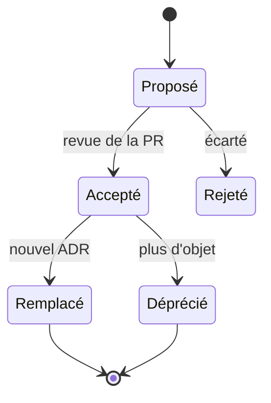

# ADR et design docs

## Aperçu

- Un **ADR** (Architecture Decision Record) est un court fichier qui consigne **une** décision d'architecture : le contexte, ce qui a été décidé, les conséquences. Les ADR s'accumulent dans le dépôt et forment le journal des décisions du projet.
- Un **design doc** (ou RFC) est le document **d'avant** : il explore le problème et compare des solutions pour en choisir une. L'ADR garde la trace de ce choix, une fois fait.
- Ce qui se perd dans un projet n'est pas le code mais le **pourquoi**. L'ADR le conserve pour la personne qui reprend le projet, ou pour l'agent qui en lit le contexte.

## Concepts clés

### Le format de Nygard

Michael Nygard propose le format en 2011 (« Documenting Architecture Decisions »). Cinq éléments :

- **Titre** : un groupe nominal court.
- **Contexte** : les forces en présence (techniques, politiques, sociales, propres au projet), dans un langage neutre.
- **Décision** : la réponse de l'équipe, formulée « Nous allons… ».
- **Statut** : proposé, accepté, déprécié ou remplacé (avec renvoi vers l'ADR qui remplace).
- **Conséquences** : tout ce qui en découle, positif, négatif ou neutre.

Longueur visée : une à deux pages, en phrases complètes plutôt qu'en listes. Les ADR sont numérotés de façon séquentielle et monotone, **sans réutilisation de numéro**, et rangés dans le dépôt (`doc/arch/adr-NNN.md` chez Nygard). Une décision remplacée n'est pas supprimée : elle est marquée comme telle.



### MADR

MADR (Markdown Architectural Decision Records) est un gabarit communautaire, en version 4.0.0 (septembre 2024), sous double licence MIT et CC0. Il existe en variantes complète, minimale et « bare ». Le statut passe dans un frontmatter optionnel (`status`, `date`, `decision-makers`, `consulted`, `informed`). Sections : *Context and Problem Statement*, *Decision Drivers* (optionnelle), *Considered Options*, *Decision Outcome*, puis, en option, *Consequences*, *Confirmation* (comment vérifier que la décision est tenue), *Pros and Cons of the Options*, *More Information*.

Par rapport à Nygard, MADR **force à lister les options écartées** : c'est la partie qui évite de rediscuter dix fois le même choix.

### ADR, design doc, RFC

| | Moment | Taille | Rôle |
|---|---|---|---|
| Design doc | avant de construire | 1 à 3 pages (mini) jusqu'à 10-20 pages | explorer, comparer, recueillir des avis |
| RFC | idem, avec circuit de relecture formel | variable | faire valider par une équipe élargie |
| ADR | au moment de trancher | 1 à 2 pages | consigner le choix et ses raisons |

Malte Ubl décrit (2020) la structure de design doc de Google : contexte et périmètre, objectifs et non-objectifs, la conception, alternatives envisagées, préoccupations transverses. Son critère : écrire un design doc quand la direction est incertaine ou contestée ; s'en passer quand la solution est évidente. Un design doc détaillé peut alimenter un ADR, mais l'ADR reste court.

## En pratique

### Ranger et numéroter

- Un dossier dédié dans le dépôt : `docs/adr/` ou `docs/decisions/` (MADR) ; nom de fichier `0007-choisir-postgres-pgvector.md`.
- Une PR par ADR : le statut `proposé` passe à `accepté` au merge. L'historique git donne la date et les relecteurs.
- Une décision change : **nouvel ADR** qui remplace l'ancien, lequel passe à `remplacé par ADR-00NN`. L'ancien texte n'est jamais réécrit.

### Exemple court

```markdown
---
status: accepted
date: 2026-10-07
---
# Stocker les embeddings dans PostgreSQL avec pgvector

## Context and Problem Statement
Le service de recherche doit indexer environ 2 millions de passages, sur un serveur
on-prem déjà équipé de PostgreSQL. Une base vectorielle dédiée ajouterait un service à exploiter.

## Considered Options
* PostgreSQL + pgvector
* Base vectorielle dédiée

## Decision Outcome
Chosen option: "PostgreSQL + pgvector", parce que l'exploitation existe déjà
(sauvegardes, supervision) et que le volume reste modeste.

### Consequences
* Good, parce qu'un seul service à opérer.
* Bad, parce que l'indexation vectorielle est moins fine à régler qu'ailleurs ; à revoir au-delà de 20 millions de passages.
```

### Avec des agents

- Les ADR sont du **contexte à longue durée de vie** : un agent qui lit `docs/adr/` évite de proposer ce qui a déjà été écarté. Le fichier de contexte du dépôt ([[Fichiers de contexte pour agents]]) gagne à renvoyer vers ce dossier plutôt qu'à recopier les décisions.
- L'agent peut **rédiger un brouillon** d'ADR depuis une discussion ; la décision, elle, reste humaine. Un ADR généré sans relecture est du texte plausible, pas une décision.
- Pour un projet piloté par spécification ([[Développement piloté par la spécification]]), l'ADR complète la spec : la spec dit *quoi*, l'ADR dit *pourquoi ce choix technique*.

### Pièges

- **Trop d'ADR** : consigner chaque détail dilue le journal. Un ADR se justifie quand la décision est coûteuse à défaire.
- **ADR écrit après coup** : les raisons sont reconstruites, donc suspectes.
- **Statut jamais mis à jour** : un ADR resté « proposé » depuis un an ne renseigne personne.
- En solo, l'intérêt reste réel : le « moi » d'il y a six mois est le premier lecteur.

## Approches voisines & alternatives

- [[Fichiers de contexte pour agents]] — le point d'entrée où référencer le dossier des ADR.
- [[Développement piloté par la spécification]] — la spec décrit le quoi ; l'ADR garde les raisons des choix techniques.
- [[Cycle de vie d'un projet assisté par agent]] — situe l'ADR dans le cycle, entre cadrage et réalisation.
- [[Modèle C4]] — les diagrammes montrent la structure ; les ADR expliquent pourquoi elle est ainsi.
- [[Diátaxis et docs-as-code]] — un ADR relève de l'*explication* ; il vit dans le dépôt comme le reste de la documentation.
- [[Context engineering]] — un journal de décisions est une source de contexte stable pour un agent.
- [[Mermaid]] — pour intégrer un diagramme dans un ADR sans fichier image.
- Outils (texte simple) : **adr-tools** (scripts shell, dépôt de Nat Pryce ; son dernier commit sur la branche principale date de mars 2020, donc peu entretenu même s'il n'est pas archivé) ; **log4brains** (Apache-2.0, génère un site statique de consultation ; dernière version 1.1.0 en décembre 2024, non archivé, 57 tickets ouverts). Un simple fichier et un `ls` suffisent souvent.
- Alternative : le **wiki** ou la page de ticket — les raisons y sont dispersées et ne suivent pas la version du code.

## Pour aller plus loin

- Michael Nygard (2011) — *Documenting Architecture Decisions*, cognitect.com/blog/2011/11/15/documenting-architecture-decisions.
- ADR GitHub organization (2024) — *Architectural Decision Records* et gabarit *MADR 4.0.0*, adr.github.io et adr.github.io/madr.
- Malte Ubl (2020) — *Design Docs at Google*, industrialempathy.com/posts/design-docs-at-google.
- adr-tools : github.com/npryce/adr-tools ; log4brains : github.com/thomvaill/log4brains (états relevés le 2026-10-07).
