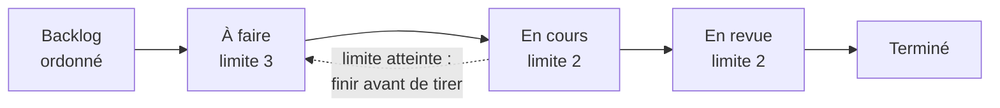

# Backlog, Kanban, Scrum et Shape Up

## Aperçu

- Quatre manières d'organiser le travail : un **backlog** (liste ordonnée de ce qui reste à faire), **Kanban** (limiter le travail en cours), **Scrum** (itérations fixes et rôles), **Shape Up** (paris de six semaines sans backlog).
- Pensées pour des équipes humaines, aucune n'est à appliquer telle quelle en solo ou avec des agents. Il s'agit d'en garder le mécanisme utile et d'écarter les cérémonies.
- Le gabarit léger : un fichier, trois colonnes, une limite de travail en cours, une revue régulière.

## Concepts clés

### Backlog

Liste ordonnée de ce qui pourrait être fait. Dans Scrum, le **Product Backlog** est la source unique du travail de l'équipe, et son ordre est de la responsabilité du Product Owner. Le défaut classique : il enfle jusqu'à devenir un cimetière d'idées que personne ne fera. Shape Up en fait une critique frontale : les backlogs sont « un grand poids dont on n'a pas besoin », ils donnent le sentiment d'être perpétuellement en retard.

### Kanban

Le Kanban Guide (2020) définit Kanban comme « une stratégie d'optimisation du flux de valeur dans un processus, avec un système visuel à flux tiré ». Trois pratiques : définir et visualiser le flux de travail, gérer activement les éléments qui y circulent, améliorer le flux. Les **limites de WIP** (travail en cours) en sont le mécanisme : un nouvel élément n'est tiré que lorsqu'il y a de la capacité. Quatre mesures de flux : WIP, débit, temps de cycle, âge de l'élément en cours.

La règle qui change le comportement : quand « En cours » est plein, on **finit** quelque chose avant d'en commencer une autre. Rien d'autre ne demande autant de discipline, ni ne rapporte autant.

### Scrum

Le Scrum Guide 2020 (Ken Schwaber et Jeff Sutherland) le décrit comme « un cadre léger » pour résoudre des problèmes complexes. Trois responsabilités : Product Owner, Scrum Master, Developers. Cinq événements, dont le **Sprint** (durée maximale d'un mois), la planification, la mêlée quotidienne de quinze minutes, la revue et la rétrospective. Trois artefacts, chacun lié à un engagement : le Product Backlog et l'objectif produit, le Sprint Backlog et l'objectif de Sprint, l'Incrément et la définition de terminé.

### Shape Up

Ryan Singer (Basecamp, 2019). Le travail est **cadré** (*shaped*) avant d'être parié. Principes :

- **Appetite** : « une estimation part d'une conception et aboutit à un nombre ; un appetite part d'un nombre et aboutit à une conception ». Le temps est fixe, le périmètre variable. Deux tailles : petit lot (une à deux semaines) ou gros lot (un cycle entier).
- **Cycles de six semaines**, suivis de deux semaines de **cool-down** sans travail planifié, pour corriger des bugs ou explorer.
- **Betting table** : réunion de la direction qui choisit, parmi quelques pitches cadrés, ceux qu'on finance pour le cycle suivant. Pas de backlog à trier.
- **Circuit breaker** : un projet non terminé à la fin du cycle n'est pas prolongé automatiquement.

### Comparaison

| | Backlog seul | Kanban | Scrum | Shape Up |
|---|---|---|---|---|
| Rythme | aucun | continu | Sprint d'un mois au plus | cycle de six semaines |
| Unité de travail | élément de liste | élément de flux | élément du Sprint Backlog | projet cadré (pitch) |
| Priorisation | ordre de la liste | ordre de tirage | Product Owner | betting table |
| Contrôle du volume | aucun | limites de WIP | objectif de Sprint | appetite, périmètre variable |
| Rôles imposés | aucun | aucun | trois | peu définis, équipes de conception et de développement |
| Mesure | aucune | débit, temps de cycle, âge | engagement et objectifs | livré ou non dans le cycle |
| Coût de mise en place | minimal | faible | élevé (événements, rôles) | moyen (travail de cadrage) |

### Et Jira ?

Jira (Atlassian, propriétaire) est la référence en entreprise. Il apporte des workflows configurables, des rapports d'avancement, des droits par projet, des intégrations (forge, CI, messagerie) et surtout de la **traçabilité** : qui a demandé quoi, quand, validé par qui. C'est ce qu'exigent un client ou un audit. Ce que tout cela coûte : configuration, administration, une charge de saisie qui finit par devenir le travail. En solo ou en petite équipe, un fichier Markdown versionné ou les tickets d'une forge libre couvrent l'essentiel, y compris l'historique, par le dépôt lui-même. Des outils libres de suivi (Redmine, Kanboard) seront traités plus tard dans le brain.

## En pratique

- **Solo** : un `BACKLOG.md` à trois sections (à faire, en cours, terminé), une limite de deux éléments en cours, une revue en fin de semaine. Les éléments sont des stories courtes avec leurs critères (voir [[PRD et user stories]]).
- **Avec agents** : la limite de WIP se réduit au nombre d'agents qu'on peut relire sans perdre le fil, souvent un à trois. Lancer cinq agents en parallèle produit cinq revues en retard, pas cinq fois plus de valeur. Chaque élément en cours = une branche ou un worktree.
- **Shape Up en solo** s'adapte bien : un appetite par fonctionnalité (« deux jours », « une semaine »), un cadrage écrit en une page, un arrêt net quand le temps est écoulé. La betting table devient une revue de pitches avec soi-même ou avec le client.
- **Scrum** n'a de sens que si l'équipe est assez nombreuse pour que les rôles et les événements aient un objet. En solo, la rétrospective seule (qu'est-ce qui a marché, qu'est-ce qu'on change) garde de la valeur.
- **Projet industriel ou ESN** : le client impose souvent un outil et un vocabulaire. Garder le suivi réel dans le dépôt, et exporter ou recopier ce que le contrat exige, plutôt que de faire du ticket la source de vérité du travail.
- Pièges : un backlog qu'on ne purge jamais (supprimer ce qui n'a pas bougé depuis des mois) ; limites de WIP posées mais jamais appliquées ; mesurer la « vélocité » comme objectif au lieu de s'en servir comme repère ; empiler des cérémonies pour une équipe d'une personne.

## Approches voisines & alternatives

- [[PRD et user stories]] — ce qu'on met dans un élément du backlog et comment on le vérifie.
- [[Développement piloté par la spécification]] — la spécification et ses tâches se rangent dans le backlog.
- [[Cycle de vie d'un projet assisté par agent]] — où le suivi du travail s'insère dans le projet entier.
- [[Branches courtes et worktrees pour agents]] — le pendant technique d'une limite de WIP : un élément, une branche isolée.
- [[Mesurer un projet - DORA, coût des agents et temps passé]] — débit, temps de cycle et âge : les mesures que Kanban recommande, et leurs cousines côté livraison.
- [[Revue, tests et définition de terminé avec un agent]] — la colonne « En revue » et la définition de terminé de Scrum.
- [[Forgejo]] — forge libre dont le suivi de tickets peut tenir lieu de backlog partagé.
- [[Forges & CI-CD]] — le hub des forges, où se trouve le suivi de tickets.
- [[Obsidian]] — un backlog en Markdown se lit et se déplace bien dans un coffre de notes.
- Alternative : **ne rien suivre hors du dépôt**. Pour un travail de quelques jours, un fichier de tâches de l'agent suffit. Ça ne passe plus dès que plusieurs personnes ou un client entrent dans la boucle.

## Pour aller plus loin

- Schwaber, K. et Sutherland, J. (2020) — *The Scrum Guide*, scrumguides.org. Définition de référence des rôles, événements et artefacts.
- Vacanti, D., Coleman, J. et autres (2020) — *The Kanban Guide*, version de juillet 2020, kanbanguides.org. Pratiques, limites de WIP, mesures de flux.
- Singer, R. (2019) — *Shape Up: Stop Running in Circles and Ship Work that Matters*, Basecamp, lecture libre en ligne ; chapitres sur l'appetite, la betting table, l'absence de backlog et les cycles de six semaines. Le texte est sous droits réservés (37signals), consultable gratuitement.
- Sur Jira : description générale d'après les fonctions connues du produit ; pas de source citée.
