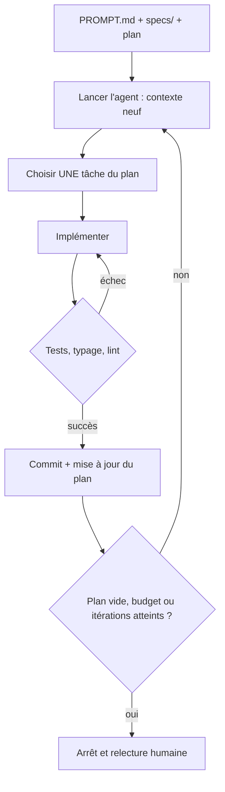

# Boucle de Ralph

## Aperçu

- Technique de Geoffrey Huntley (billet du 14 juillet 2025) : relancer **le même prompt** dans une boucle shell, `while :; do cat PROMPT.md | agent ; done`, jusqu'à ce que le plan soit épuisé.
- Chaque tour repart d'un **contexte neuf** et ne traite **qu'une tâche** ; la mémoire du travail vit dans des fichiers (spécifications, plan) et dans l'historique git, pas dans la conversation.
- Le nom est une plaisanterie assumée (le personnage des Simpson) : la méthode est « déterministiquement mauvaise dans un monde indéterministe » et compense par le nombre d'itérations et par les tests.

## Concepts clés

### La boucle

### Les trois pièces de l'état

- **Les spécifications** (`specs/`) : le comportement attendu, rédigé au départ en conversation avec le modèle.
- **Le plan** (`fix_plan.md` chez Huntley) : liste priorisée du travail restant, mise à jour à chaque tour, purgée et régénérée quand elle dérive.
- **Git** : chaque tour réussi laisse un commit ; un tour raté se défait par un retour arrière. Huntley assume le `git reset --hard` comme geste normal.

C'est le contexte neuf qui fait la méthode : une conversation longue dégrade les réponses, et Huntley situe la qualité réelle autour de 147 à 152 k tokens sur une fenêtre annoncée à 200 k. Une tâche par tour garde chaque exécution loin de cette zone. Voir [[Context engineering]].

### La contre-pression par les tests

Le code produit se heurte immédiatement à des tests, au typage, à la compilation. Ces garde-fous, pas l'intelligence du modèle, font converger la boucle. Huntley y ajoute des tests commentés (pourquoi ils existent) comme notes pour les tours suivants. Un test faible laisse passer un code faux, et la boucle le répète fidèlement.

### Variantes

- **Boucle externe** (l'original) : un script relance un processus neuf à chaque tour.
- **Boucle interne** : le plugin Ralph Wiggum de Claude Code utilise un hook d'arrêt qui bloque la sortie et réinjecte le même prompt, avec `--max-iterations` et une « promesse de complétion » (phrase exacte qui signale la fin). Cette variante reste dans **une seule session** : l'état passe par les fichiers et git, mais le contexte, lui, s'accumule. C'est une approximation de la technique, pas la technique.
- **Plusieurs agents en parallèle** : [[swarm-forge]] isole chaque agent dans son propre worktree, et sa porte d'audit refuse de resoumettre deux fois un handoff inchangé, garde-fou contre les boucles stériles.

## En pratique

**Quand ça marche**

- Tâches **vérifiables par une commande** : tests qui passent, migration mécanique, couverture à monter.
- **Plan clair et découpé** en éléments de la taille d'un tour.
- Projet **neuf** : Huntley compte sur environ 90 % d'achèvement et dit qu'il n'emploierait pas la technique sur une base de code existante. Le plugin recommande de même les projets neufs et les critères de réussite automatiques.

**Quand ça dérive**

- **Spécification floue** : sans critère de fin, la boucle invente du travail ou tourne en rond. Écrire la spécification d'abord, comme le fait [[Spec Kit]] (`/speckit.specify`, `plan`, `tasks`, puis `implement`), est le pré-requis, pas un luxe : voir [[Développement piloté par la spécification]].
- **Tests faibles ou absents** : la boucle optimise ce qui est mesuré.
- **Jugement humain requis** (choix d'architecture, UX, débogage en production) : le plugin lui-même déconseille ces cas.
- **Coût en jetons** : une boucle sans plafond brûle du budget à chaque tour, y compris quand elle est coincée.
- **Boucle infinie** : un test qui ne peut jamais passer, une consigne contradictoire, un plan qui se réécrit sans avancer.
- **Dette cachée** : Huntley défend l'idée qu'on régénère plutôt qu'on ne maintient. Pour un code qui doit vivre chez un client, cette position ne tient pas, et la relecture reste due ([[Revue, tests et définition de terminé avec un agent]]).

**Garde-fous minimaux**

1. **Nombre maximal d'itérations**, toujours : c'est le filet de sécurité principal selon le plugin.
2. **Critère d'arrêt vérifiable** : tous les tests verts, plan vide, ou promesse de complétion émise après exécution des tests.
3. **Budget** en jetons ou en euros, coupé côté fournisseur et pas seulement dans le script.
4. **Branche et worktree dédiés** ([[Branches courtes et worktrees pour agents]]) : la boucle ne touche jamais la branche principale.
5. **Détection de stagnation** : arrêt si deux tours de suite produisent le même diff ou la même erreur.
6. **Pas de secret ni d'accès large** dans l'environnement de la boucle : elle tourne sans personne devant.

**Sur un projet on-prem** : l'avantage est un modèle local (coût marginal nul par tour), l'inconvénient une qualité moindre qui multiplie les tours ; les plafonds restent utiles, ne serait-ce que pour la durée machine.

## Approches voisines & alternatives

- [[Développement piloté par la spécification]] — fournit la spécification et le plan dont la boucle a besoin ; la boucle est l'exécuteur.
- [[Spec Kit]] — brique : produit constitution, spécification, plan et tâches, que la boucle peut consommer une tâche par tour.
- [[swarm-forge]] — brique : orchestration de plusieurs agents, un worktree chacun, handoffs et porte d'audit.
- [[Branches courtes et worktrees pour agents]] — l'isolement dans lequel faire tourner la boucle.
- [[Revue, tests et définition de terminé avec un agent]] — ce qui décide qu'une sortie de boucle est acceptable.
- [[Context engineering]] — le contexte neuf par tour est une stratégie d'isolation du contexte.
- [[Agent patterns]] — la boucle de Ralph est le cas le plus nu de boucle d'agent, sans orchestrateur.
- [[Agent evaluation]] — mesurer si la boucle converge, plutôt que juger sur une démonstration.
- [[Vibe coding contre ingénierie agentique]] — la boucle de Ralph est du côté ingénierie seulement si les tests existent.
- Alternative : **un agent interactif supervisé**, une tâche à la fois avec relecture. Plus lent, mais sans risque de dérive silencieuse.

## Pour aller plus loin

- Huntley (2025) — *Ralph Wiggum as a "software engineer"*, ghuntley.com/ralph (14 juillet 2025) : la boucle, `specs/`, `fix_plan.md`, un élément par tour, tests après chaque changement, tag git dès que build et tests passent, limites assumées.
- Anthropic (s. d.) — plugin `ralph-wiggum`, dépôt `anthropics/claude-code` : variante par hook d'arrêt, `--max-iterations`, `--completion-promise`, cas d'usage et cas à éviter.
- Le plugin cite des résultats spectaculaires (sous-traitance menée à terme pour quelques centaines de dollars de jetons) : anecdotes rapportées, sans protocole de mesure.
