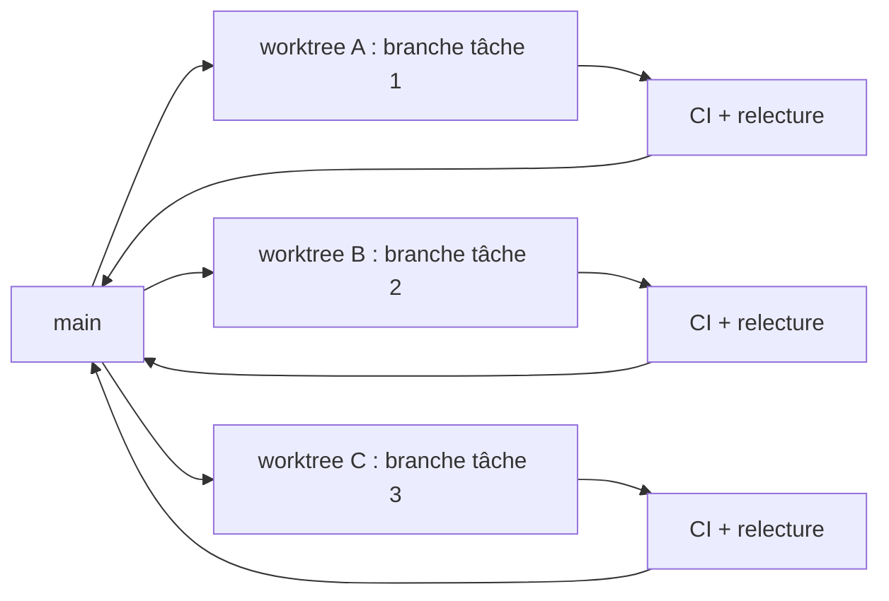

# Branches courtes et worktrees pour agents

## Aperçu

- Faire travailler plusieurs agents sur un même dépôt suppose d'isoler leurs fichiers : **un worktree par agent**, sur **une branche courte** fusionnée vite.
- `git worktree` donne plusieurs répertoires de travail rattachés au même dépôt, sans cloner à nouveau ; le *trunk-based development* donne la discipline de fusion qui évite que ces branches divergent.
- Le gain est l'isolement des fichiers, pas la coordination : deux agents qui modifient la même fonction se retrouvent en conflit à la fusion, worktree ou non.

## Concepts clés

### `git worktree`

Un dépôt a un **worktree principal** (créé par `git init` ou `git clone`) et des **worktrees liés** créés par `git worktree add`. Chacun a son répertoire, son `HEAD` et son index, mais ils partagent la base d'objets, les références `refs/heads/*` et `refs/tags/*` et la configuration du dépôt.

```bash
git worktree add -b agent-a ../projet-agent-a   # nouvelle branche + répertoire
git worktree list
git worktree remove ../projet-agent-a           # jamais un simple rm -rf
git worktree prune                              # nettoie les métadonnées orphelines
```

Règles de la documentation git :

- une **branche ne peut être extraite que dans un seul worktree** à la fois (contournable par `--force`, à éviter) ;
- supprimer le répertoire à la main laisse des métadonnées, d'où `remove` et `prune` ;
- `lock` protège un worktree de la purge, `repair` répare les liens après un déplacement ;
- la documentation précise que l'extraction multiple reste **expérimentale**, avec un support incomplet des sous-modules.

Un worktree est une **extraction neuve** : fichiers ignorés par git (`.env`), environnement virtuel et dépendances n'y sont pas.

### Branches courtes et trunk-based development

Le principe, tel que décrit par trunkbaseddevelopment.com : une branche de courte durée « ne devrait durer que quelques jours », avec un développeur par branche (deux en binôme) ; on y fusionne le tronc pour rester à jour, et on ne fusionne **vers** le tronc qu'à la clôture, juste avant de supprimer la branche. Pas de fusion entre branches de développeurs, pas de fusion intermédiaire vers le tronc. Au-delà de deux jours, le risque est de glisser vers la branche longue, source des conflits.

Pour un agent, la règle s'applique plus fort : **une branche = une tâche = un agent**, vérifiée par la CI avant fusion.



### Isolation des fichiers, pas des idées

L'isolement empêche l'écrasement en direct ; il ne supprime pas les conflits. Deux sortes à distinguer :

- **conflit textuel** : le même fichier modifié sur deux branches, git le signale ;
- **conflit sémantique** : deux branches qui fusionnent sans conflit mais dont l'union casse un test (une fonction renommée par l'une, appelée par l'autre). Seule la CI sur le résultat de la fusion le voit.

## En pratique

- **Un worktree par agent, une tâche par branche**, nommés d'après la tâche. Fusionner chaque branche dès qu'elle est verte, plutôt que d'accumuler.
- **Découper pour ne pas se recouvrir** : attribuer à chaque agent des fichiers ou des modules disjoints. Deux agents sur le même fichier, c'est la source la plus directe de conflit ; mieux vaut les séquencer que les paralléliser.
- **Fusionner souvent le tronc dans la branche** avant de demander la fusion, pour que les conflits se règlent sur le petit diff d'une tâche.
- **Initialiser l'environnement dans chaque worktree** : `uv sync` (voir [[uv]]) ou équivalent, copie des fichiers `.env`. Claude Code propose un fichier `.worktreeinclude` qui copie les fichiers ignorés dans chaque worktree qu'il crée ; avec `git worktree add` à la main, c'est un script maison.
- **Ressources partagées de la machine** : ports de serveurs de test, bases locales, caches, GPU. Deux worktrees qui lancent le même service sur le même port se bloquent. Prévoir un port ou une base par worktree (variable d'environnement dérivée du nom de branche) ou des conteneurs séparés ([[testcontainers]]).
- **Mémoire et configuration partagées** : la documentation de Claude Code note que la mémoire automatique est partagée entre worktrees d'un même dépôt, et qu'un fichier local ignoré par git n'existe que dans le worktree où il a été créé (voir [[Fichiers de contexte pour agents]]).
- **Nettoyage** : les worktrees abandonnés s'accumulent et occupent du disque (une extraction complète chacun, dépendances comprises). `git worktree list` régulièrement, `remove` quand la branche est fusionnée.
- **Relecture avant fusion** : une branche d'agent se traite comme une contribution externe ; la CI ([[GitHub Actions]], ou la CI intégrée à [[GitLab CE]] ou [[Forgejo]]) et une relecture humaine précèdent la fusion. Voir [[Revue, tests et définition de terminé avec un agent]].
- **Sur un projet on-prem ou ESN** : forge interne (GitLab CE, Forgejo) avec demandes de fusion obligatoires et CI sur runner interne. Les branches protégées empêchent un agent de pousser sur le tronc, même par erreur.

**Outils de parallélisation** : plusieurs outils organisent le lancement d'agents en parallèle, un worktree par session, avec un tableau de suivi (Claude Squad, Vibe Kanban, Crystal). Ils ajoutent l'ergonomie, pas le principe : tout repose sur les mêmes worktrees git. Deux briques du brain vont dans ce sens : [[t3code]] (surface de contrôle au-dessus des CLI d'agents installées) et [[swarm-forge]] (orchestrateur tmux, un worktree par agent, handoffs entre agents).

**Limites**

- Le gain de débit est réel seulement si les tâches sont **indépendantes** ; sinon le temps gagné en génération se perd en résolution de conflits et en relecture.
- La **relecture humaine** devient le goulot : N agents produisent N diffs à relire. Passé quelques agents, la capacité de relecture borne le débit (constat de bon sens, non mesuré ici).
- Le coût en jetons croît avec le nombre d'agents, sans gain garanti ([[Boucle de Ralph]] pour le plafonnement).

## Approches voisines & alternatives

- [[swarm-forge]] — brique : un worktree par agent, handoffs, porte d'audit contre les boucles stériles.
- [[t3code]] — brique : supervision de plusieurs sessions d'agents depuis une interface unique.
- [[Boucle de Ralph]] — la boucle à lancer *dans* un worktree dédié, avec plafond d'itérations.
- [[Forgejo]] — forge libre auto-hébergée : demandes de fusion, branches protégées, CI.
- [[GitLab CE]] — forge auto-hébergée, demandes de fusion et pipelines intégrés.
- [[GitHub Actions]] — CI déclenchée sur chaque branche ou demande de fusion, là où les conflits sémantiques apparaissent.
- [[Forges & CI-CD]] — le hub des forges et des outils de CI.
- [[Revue, tests et définition de terminé avec un agent]] — le contrôle avant fusion.
- [[Commits conventionnels, versions et changelog]] — des commits lisibles facilitent la relecture de dizaines de branches.
- [[Cycle de vie d'un projet assisté par agent]] — où ce découpage en tâches parallèles s'insère.
- [[Agents de code]] — le hub des agents qui travaillent dans ces worktrees.
- Alternatives : **clones séparés** (isolement total mais base d'objets dupliquée) ; **un seul agent à la fois** sur le tronc, sans parallélisme mais sans conflit ; **branches longues par fonctionnalité**, déconseillées par le trunk-based development.

## Pour aller plus loin

- Git (s. d.) — *git-worktree*, documentation officielle : commandes, restriction d'une branche par worktree, données partagées, statut expérimental.
- trunkbaseddevelopment.com (s. d.) — *Short-Lived Feature Branches* : durée, nombre de développeurs, règles de fusion. Auteur et année non indiqués sur la page.
- Anthropic (s. d.) — *Run parallel sessions with worktrees*, documentation de Claude Code : création, nettoyage, `.worktreeinclude`, ce qui est partagé entre worktrees.
