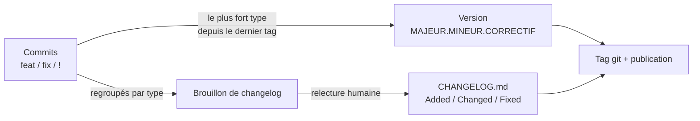

# Commits conventionnels, versions et changelog

## Aperçu

- Trois conventions qui s'emboîtent : le **message de commit** dit la nature du changement (Conventional Commits), le **numéro de version** dit son effet sur les utilisateurs (SemVer), le **changelog** le raconte à un humain (Keep a Changelog).
- Le gain est mécanique : si les commits sont écrits selon une grammaire, le prochain numéro de version se calcule et le brouillon du changelog se génère.
- Aucune des trois n'est magique : elles ne valent que par la discipline de l'écriture du commit, et SemVer ne convient pas à tout (voir CalVer plus bas).

## Concepts clés

### Conventional Commits 1.0.0

Un message se compose d'un **type**, d'un **scope** facultatif entre parenthèses, d'un `!` facultatif, de `:` et d'une description courte ; un corps et des pieds de page (*footers*) suivent, séparés par une ligne vide.

```
feat(api)!: retirer l'endpoint /v1/predict

BREAKING CHANGE: remplacé par /v2/predict, voir la migration.
```

- `fix` corrige un bogue ; `feat` ajoute une fonctionnalité. Ce sont les deux seuls types qui ont un sens dans la spécification.
- D'autres types sont permis sans être normés : `docs`, `style`, `refactor`, `perf`, `test`, `build`, `ci`, `chore`.
- Un changement **incompatible** se signale par `!` après le type (ou le scope), par un pied de page `BREAKING CHANGE:`, ou les deux, **quel que soit le type**.

### SemVer 2.0.0

Une version s'écrit `MAJEUR.MINEUR.CORRECTIF`. On incrémente le **majeur** pour un changement d'API incompatible, le **mineur** pour un ajout compatible, le **correctif** pour une correction compatible.

- SemVer suppose une **API publique déclarée**, « précise et complète » : sans elle, le numéro ne veut rien dire.
- En `0.y.z`, tout peut changer à tout moment ; `1.0.0` définit l'API publique.
- Une version publiée **ne se modifie jamais** : une correction part en version suivante.
- Pré-version (`1.0.0-alpha`) : précédence inférieure à la version normale. Métadonnées de build (`+...`) : ignorées à la comparaison.

### Keep a Changelog 1.1.0

Un fichier `CHANGELOG.md` écrit **pour des humains**, une entrée par version, la plus récente en haut, avec une date ISO 8601 (`AAAA-MM-JJ`). Les changements se rangent sous six rubriques : `Added`, `Changed`, `Deprecated`, `Removed`, `Fixed`, `Security`. Une section `Unreleased` en tête accumule ce qui part au prochain numéro.

Sa thèse est explicite : un journal de commits **n'est pas** un changelog, car il est « plein de bruit » (fusions, titres obscurs, changements de documentation).

### L'enchaînement



Règle de lecture : `fix` donne un correctif, `feat` un mineur, tout `!` ou `BREAKING CHANGE` un majeur. Le plus fort des commits depuis le dernier tag décide. Les outils font ce calcul ; l'étape « relecture humaine » est celle que l'automatisation tend à supprimer, à tort.

### CalVer, l'alternative

Le versionnage calendaire encode **la date** de sortie (`AA.MM`, `AAAA.MM.JJ`, ou `AA.MINEUR.CORRECTIF`) au lieu de la compatibilité. Ubuntu (`AA.0M`, depuis 2004), pip et Black l'utilisent. Il convient à une **application**, un outil ou un service dont la cadence suit le calendrier et où « changement incompatible » ne guide pas la décision de mise à jour. Il convient mal à une bibliothèque dont les dépendants posent des bornes (`>=1.0,<2.0`). Brett Cannon objecte à l'inverse que presque tout changement de bibliothèque peut casser quelqu'un : SemVer promet plus qu'il ne peut tenir.

## En pratique

- **Solo** : écrire les commits en `type: description` par habitude, ne rien automatiser au début. Un `CHANGELOG.md` tenu à la main à chaque version reste lisible et force à relire ce qui part.
- **Vérifier le message** : un hook `commit-msg` lancé par pre-commit refuse un message non conforme avant qu'il entre dans l'historique ; la même vérification se rejoue en CI (GitHub Actions, Forgejo Actions, GitLab CI) pour attraper ce qui a contourné le poste.
- **Outils** (texte simple, aucune brique pour l'instant) : Commitizen (assistant de saisie, contrôle `cz check`, calcul de version `cz bump`, changelog) ; git-cliff (générateur de changelog personnalisable par gabarit, écrit en Rust) ; release-please (ouvre et tient à jour une *pull request* de release ; limité à GitHub) ; python-semantic-release (calcule la version, tague, publie ; gère GitHub, GitLab, Gitea et Bitbucket). Sur une forge auto-hébergée (Forgejo, GitLab CE), le choix se réduit de fait à ce qui sait parler à cette forge : Commitizen et git-cliff n'en dépendent pas, release-please si.
- **Commit par petit groupe** : un commit par page, par tâche ou par petit groupe cohérent, pas un commit fourre-tout en fin de journée. C'est ce qui rend le type (`feat`, `fix`) honnête et le changelog exploitable. Un agent de code qui commit suit **la même convention** que l'humain : la consigne va dans le fichier de contexte du projet, et le hook `commit-msg` fait foi, pas la bonne volonté de l'agent.
- **On-prem industriel / ESN** : le client veut souvent un numéro de version et une liste de changements par livraison. Le changelog sert alors de pièce de recette ; il se rédige pour le lecteur du client, pas pour l'équipe.
- **Pièges**
  - Commit fourre-tout : un seul `feat` pour dix changements, le calcul de version et le changelog n'ont plus de sens.
  - Changelog généré sans relecture : on retombe sur le journal de commits que Keep a Changelog déconseille.
  - SemVer sur une **application** ou un **modèle ML** : il n'y a pas d'API publique à déclarer ; que veut dire « majeur » pour un modèle dont les sorties changent avec les données ? Versionner le code par CalVer ou SemVer d'API, et le modèle par un identifiant d'entraînement et de jeu de données.
  - `0.y.z` éternel : rester en `0.x` pour s'exonérer de la compatibilité est un contournement, pas une pratique.
  - Les types hors `feat`/`fix` sont une convention d'équipe (python-semantic-release en connaît plusieurs : Conventional Commits, Angular, SciPy, emoji), pas la spécification : se mettre d'accord par écrit.

## Approches voisines & alternatives

- [[pre-commit]] — porte le hook `commit-msg` qui refuse un message non conforme avant le commit.
- [[GitHub Actions]] — rejoue la vérification des messages et lance les outils de release.
- [[Forgejo]] — forge auto-hébergée ; ses Actions rejouent les mêmes contrôles et publient les releases.
- [[GitLab CE]] — forge auto-hébergée ; la CI GitLab remplit le même rôle.
- [[Fichiers de contexte pour agents]] — l'endroit où écrire la convention de commit pour qu'un agent la suive.
- [[Branches courtes et worktrees pour agents]] — les petits commits d'un agent s'y accumulent, un worktree par tâche.
- [[Cycle de vie d'un projet assisté par agent]] — situe la phase de livraison où ces conventions s'appliquent.
- [[Mesurer un projet - DORA, coût des agents et temps passé]] — la fréquence de déploiement et le délai de mise en production se lisent sur ces tags et ces releases.
- [[Revue, tests et définition de terminé avec un agent]] — le commit n'est « terminé » qu'après revue et tests.
- Alternative : **CalVer** (ci-dessus), ou un simple numéro de build daté pour un service interne que personne ne dépend en bibliothèque.

## Pour aller plus loin

- *Conventional Commits 1.0.0* — https://www.conventionalcommits.org/en/v1.0.0/ (spécification, CC BY 3.0 ; auteur et date non indiqués sur la page).
- *Semantic Versioning 2.0.0* — https://semver.org/ (auteur non relevé sur la page lue).
- Olivier Lacan, *Keep a Changelog 1.1.0* — https://keepachangelog.com/en/1.1.0/.
- *CalVer* — https://calver.org/ (page non ouverte : site inaccessible depuis l'environnement de rédaction ; la notation et les exemples viennent de pydevtools, ci-dessous).
- pydevtools, *Versioning Python packages: SemVer, CalVer, and PEP 440* — https://pydevtools.com/handbook/explanation/versioning-python-packages-semver-calver-and-pep-440/ (pip et Black en CalVer ; objection de Brett Cannon à SemVer).
- Documentation de Commitizen — https://commitizen-tools.github.io/commitizen/ ; git-cliff — https://github.com/orhun/git-cliff (Rust, Apache-2.0 ou MIT) ; release-please — https://github.com/googleapis/release-please (GitHub seulement, Apache-2.0) ; python-semantic-release — https://python-semantic-release.readthedocs.io/en/latest/.
- pre-commit, étape `commit-msg` — https://pre-commit.com/.
