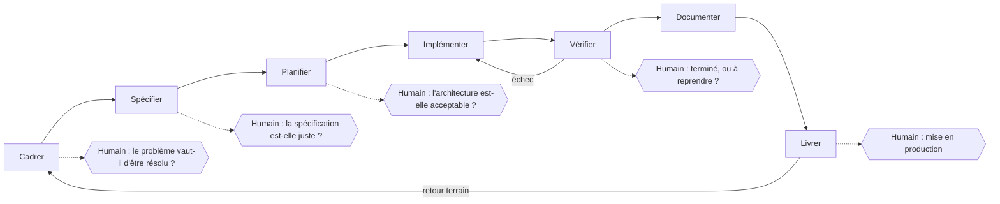

# Cycle de vie d'un projet assisté par agent

## Aperçu

- Un projet mené avec un agent de code garde les étapes d'un projet classique (cadrer, spécifier, planifier, implémenter, vérifier, documenter, livrer). Ce qui change : **qui produit** chaque étape et **où se place la décision humaine**.
- L'agent produit vite et en volume ; la valeur humaine se déplace vers le cadrage, l'arbitrage et la vérification.
- Cette page est la carte : chaque étape renvoie à la notion qui la détaille.

## Concepts clés

### Le cycle et ses points de décision

Les flèches pleines sont des étapes, les pointillés sont des **portes** : l'agent s'arrête, l'humain tranche. Un cycle sans porte est du vibe coding ([[Vibe coding contre ingénierie agentique]]).

### Étape par étape

| Étape | L'agent fait bien | L'agent fait mal | L'humain décide |
|---|---|---|---|
| Cadrer | reformuler, poser des questions, lister des options | savoir ce qui compte pour l'organisation | le problème, le périmètre, le refus |
| Spécifier | rédiger un brouillon de PRD ou de spécification à partir d'un entretien | trancher les cas limites métier | la spécification validée |
| Planifier | découper en tâches, proposer une architecture | arbitrer coût, dette, contraintes d'exploitation | l'architecture, l'ordre, ce qu'on ne fait pas |
| Implémenter | écrire du code conforme à un modèle existant, mécanique, volumineux | rester dans le périmètre, ne pas inventer d'API | rien, tant que les portes amont ont tenu |
| Vérifier | exécuter les tests, lire les messages d'erreur, itérer | juger ses propres tests (voir la page dédiée) | le critère de terminé |
| Documenter | produire un premier jet fidèle au code | savoir pour qui et pourquoi | ce qui mérite d'être gardé |
| Livrer | enchaîner commits, changelog, PR | évaluer le risque d'une mise en production | le go, le retour arrière |

La documentation officielle de Claude Code formule la même séquence pour un agent : explorer, planifier, implémenter, commiter, avec une phase de planification séparée de l'exécution « pour éviter de résoudre le mauvais problème ». Elle précise aussi : si le diff tient en une phrase, la planification est superflue.

### Étapes et notions sœurs

- Cadrer et spécifier : [[PRD et user stories]], [[Développement piloté par la spécification]].
- Planifier : [[ADR et design docs]], [[Modèle C4]], [[Backlog, Kanban, Scrum et Shape Up]].
- Implémenter : [[Fichiers de contexte pour agents]], [[Boucle de Ralph]], [[Branches courtes et worktrees pour agents]].
- Vérifier : [[Revue, tests et définition de terminé avec un agent]].
- Documenter : [[Diátaxis et docs-as-code]].
- Livrer et mesurer : [[Commits conventionnels, versions et changelog]], [[Mesurer un projet - DORA, coût des agents et temps passé]].

### Où se rangent les outils

- Cadrage à planification outillés : [[BMAD]] (agents nommés : analyste, PM, architecte, développeur, test architect ; la documentation précise que l'humain « prend les décisions ») et [[Spec Kit]] (constitution, spécification, plan, tâches, implémentation).
- Contexte du dépôt : [[Graphify]] (graphe de connaissance du dépôt) et [[ai-memory]] (mémoire de sessions partagée entre agents) évitent de réexpliquer le projet à chaque session.
- Discipline de sortie de l'agent : [[i-have-adhd]] (règles de forme des réponses).
- Parallélisme : [[swarm-forge]] (agents dans des worktrees séparés, relais validés par une porte d'audit) et [[t3code]] (plan de contrôle au-dessus de plusieurs CLI d'agents).

## En pratique

- **Écrire les portes avant de lancer l'agent** : à chaque étape, un artefact relu par un humain (spécification, plan, diff), pas seulement une conversation.
- **Une session propre par étape** : le contexte se dégrade à mesure qu'il se remplit ; la documentation de Claude Code recommande de repartir d'une session vierge avec la spécification écrite pour l'exécution. Voir [[Context engineering]].
- **Solo** : le cycle tient en une page de notes, une spécification courte et une liste de tâches ; le coût de l'agent est surtout celui de la relecture.
- **On-prem industriel ou ESN** : le cycle s'allonge de portes imposées par le client (recette, validation sécurité, changement en production). L'agent n'a aucune raison de court-circuiter ces portes ; il peut en préparer les dossiers.
- **Pièges** : implémenter avant d'avoir spécifié (l'agent comble les vides par des choix plausibles) ; laisser l'agent valider ses propres tests ; ne pas mesurer, donc ne pas savoir si le cycle accélère quoi que ce soit (la mesure randomisée de METR a trouvé 19 % de temps en plus, voir [[Vibe coding contre ingénierie agentique]]).

## Approches voisines & alternatives

- [[Agent patterns]] — les patrons d'organisation de la boucle d'un agent (un cran en dessous : l'intérieur d'une étape).
- [[Agents de code]] — le hub des agents qui exécutent ces étapes ([[Aider]], [[Cline]], [[OpenCode]] pour les variantes libres).
- [[Context engineering]] — ce qu'il faut mettre dans la fenêtre à chaque étape.
- [[Agent skills]] — encoder une étape récurrente (revue, clôture) en procédure rejouable.
- [[Agent evaluation]] — mesurer l'agent lui-même, distinct de mesurer le projet.
- Alternative : **cycle itératif court sans spécification** — adapté à l'exploration, risqué dès que le code vit longtemps.

## Pour aller plus loin

- Anthropic (2025-2026) — *Best practices for Claude Code* : explorer, planifier, implémenter, commiter ; donner à l'agent un moyen de vérifier son travail ; `/clear` entre tâches sans rapport. https://code.claude.com/docs/en/best-practices
- BMAD (2026) — documentation : phases Clarify, Plan, Build and Verify, Learn and Adjust ; « You make the calls ». https://docs.bmad-method.org/
- GitHub (2025-2026) — *Spec Kit* : phases de la méthode, licence MIT. https://github.com/github/spec-kit
- Becker, Rush, Barnes, Rein, METR (2025) — *Early-2025 AI experienced OS dev study* : 16 développeurs, 246 tâches, 19 % de temps en plus avec l'IA. https://metr.org/blog/2025-07-10-early-2025-ai-experienced-os-dev-study/
