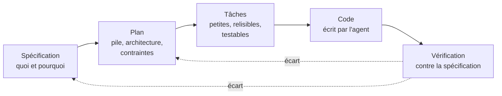

# Développement piloté par la spécification

## Aperçu

- Le **développement piloté par la spécification** (SDD) consiste à écrire ce que le logiciel doit faire **avant** de le coder, puis à dériver de cette spécification un plan, des tâches et le code.
- Avec un agent de code, la spécification remplace le prompt improvisé : elle donne à l'agent une intention stable, relisible et versionnée, au lieu d'une conversation que personne ne rejouera.
- Ce n'est pas gratuit : la spécification se rédige, se relit et se tient à jour. Le gain dépend de la taille du problème.

## Concepts clés

### La chaîne spécification, plan, tâches, code

Le principe revendiqué par Spec Kit : définir le **quoi et le pourquoi** avant de décider du **comment**. Chaque étape produit un artefact en Markdown, relu par l'humain avant de passer à la suivante.

- **Spécification** : parcours utilisateur, résultats attendus, cas limites. Pas de choix technique.
- **Plan** : pile, architecture, contraintes d'organisation. C'est là que se posent les décisions que garde ensuite un ADR.
- **Tâches** : découpage en morceaux assez petits pour être relus et testés un par un.
- **Vérification** : le code est comparé à la spécification, pas seulement exécuté. La flèche de retour compte : un écart peut révéler une spécification fausse, pas un code fautif.

### Les outils

| Outil | Artefacts | Licence |
|---|---|---|
| [[Spec Kit]] (GitHub) | constitution, spécification, plan, tâches, implémentation | MIT |
| [[BMAD]] | agents spécialisés, briefs, spécifications, architecture | MIT |
| OpenSpec (dépôt Fission-AI/OpenSpec) | une proposition, des specs et un dossier par changement, puis archivage | MIT |
| Kiro (AWS) | `requirements.md`, `design.md`, `tasks.md` | propriétaire |

Böckeler distingue trois niveaux d'ambition : **spec-first** (la spécification précède le code puis n'est plus maintenue), **spec-anchored** (elle persiste et évolue avec la fonctionnalité) et **spec-as-source** (seule la spécification s'édite, le code est généré). Les outils ci-dessus relèvent surtout des deux premiers.

Kiro est cité pour mémoire : produit propriétaire, hors périmètre du brain. OpenSpec se distingue par son unité de travail, le **changement** : chaque modification a son dossier (proposition, scénarios, design, checklist), archivé une fois livrée. Cela convient mieux aux bases de code existantes qu'au projet vierge.

### Limites et coût

- **Surcoût de rédaction et de relecture.** Böckeler (Thoughtworks, 2025) a testé Kiro et Spec Kit : Kiro lui a semblé « un marteau-pilon pour écraser une noix » sur un petit correctif, Spec Kit disproportionné pour une fonctionnalité de taille moyenne. Les fichiers générés sont répétitifs et pénibles à relire : « je préfère relire du code que tous ces fichiers Markdown ».
- **Une spécification qui dérive du code.** Dès que le code change sans que la spécification suive, elle devient une fausse source de vérité, pire qu'une absence de spécification. Sans discipline de mise à jour, la chaîne se casse au premier correctif.
- **Faux sentiment de rigueur.** Une spécification détaillée ne garantit pas que l'agent la suive : il ignore ou sur-applique des consignes, et peut lire une documentation comme une nouvelle exigence (cas observé : classes existantes dupliquées). La vérification reste nécessaire.
- **Parenthèse historique.** Böckeler rapproche le SDD poussé à l'extrême (la spécification comme seule source, le code généré) de l'ingénierie dirigée par les modèles : risque de cumuler la rigidité de celle-ci et le non-déterminisme des modèles de langage.
- **Frontière fonctionnel et technique floue.** Savoir ce qui relève de la spécification (quoi) et du plan (comment) n'a rien d'évident, et c'est justement la distinction sur laquelle repose la méthode.

## En pratique

- **Proportionner.** Correctif ou petite fonctionnalité : un prompt précis et un test suffisent. Spécification complète pour ce qui est nouveau, ambigu, ou qui touche plusieurs modules.
- **En solo**, le gain principal est la **mémoire** : la spécification et le plan survivent à la session de l'agent et se reprennent le lendemain. Une page courte vaut mieux que cinq pages générées.
- **Avec agents**, faire relire à l'agent la spécification avant le plan, en lui demandant les ambiguïtés. Les questions ouvertes se tranchent par écrit dans le document, pas dans la conversation.
- **Sur un projet industriel ou en ESN**, la spécification tient aussi lieu de trace pour le client : ce qui a été demandé, ce qui a été décidé. Les artefacts vivent dans le dépôt, à côté du code, et sont revus comme lui.
- **Garder les artefacts courts**, avec des critères d'acceptation vérifiables (voir [[PRD et user stories]]) : c'est ce qui permet de vérifier le résultat plutôt que de le croire.
- Pièges : spécifier le comment dans la spécification ; générer des documents que personne ne relit ; ne pas archiver ni supprimer la spécification d'une fonctionnalité abandonnée ; oublier de mettre à jour la spécification après un correctif.

## Approches voisines & alternatives

- [[Spec Kit]] — l'outil libre de GitHub, avec ses étapes constitution, spécification, plan, tâches et implémentation.
- [[BMAD]] — méthode à base d'agents spécialisés ; plus lourde, couvre aussi le cadrage produit.
- [[PRD et user stories]] — le contenu d'une spécification côté produit : problème, exigences, critères d'acceptation.
- [[ADR et design docs]] — la trace des décisions du plan, qui survit à la fonctionnalité.
- [[Fichiers de contexte pour agents]] — les règles permanentes du dépôt, que la « constitution » de Spec Kit reprend en partie.
- [[Context engineering]] — la spécification est un cas particulier : fournir à l'agent l'information utile, au bon moment.
- [[Agent skills]] — les étapes d'un flux SDD s'écrivent souvent comme des skills ou des commandes réutilisables.
- [[Vibe coding contre ingénierie agentique]] — l'opposé : décrire un objectif et accepter ce qui sort.
- [[Revue, tests et définition de terminé avec un agent]] — la vérification qui ferme la chaîne.
- [[Cycle de vie d'un projet assisté par agent]] — où le SDD s'insère dans le projet entier.
- [[Agent OS]], [[Backlog.md - l'outil]] — briques : les règles de code injectées à l'agent, et les tâches avec critères d'acceptation relues avant le code.
- Alternative : **tests d'abord** (TDD). Le test est une spécification exécutable, donc impossible à laisser dériver ; il ne couvre pas l'intention ni l'architecture.

## Pour aller plus loin

- Delimarsky, D. (2025) — *Spec-driven development with AI: get started with a new open-source toolkit*, blog GitHub, 2 septembre 2025. Présente les quatre phases de Spec Kit et l'opposition au vibe coding.
- Spec Kit — dépôt `github/spec-kit` : flux constitution, spécification, plan, tâches, implémentation ; licence MIT.
- OpenSpec — dépôt `Fission-AI/OpenSpec` : proposition, specs, changements, archivage ; licence MIT.
- Kiro — documentation des specs (kiro.dev, produit AWS) : `requirements.md`, `design.md`, `tasks.md`. Annoncé le 17 juillet 2025 d'après la presse spécialisée.
- Böckeler, B. (2025) — *Understanding Spec-Driven-Development: Kiro, spec-kit, and Tessl*, martinfowler.com, 15 octobre 2025. La critique la plus précise : taille du problème, charge de relecture, rapprochement avec le MDD.
- Spolsky, J. (2000) — *Painless Functional Specifications, Part 1: Why Bother?*, Joel on Software. Plaidoyer ancien pour écrire la spécification avant le code, antérieur aux agents : améliorer la conception, la communication, l'estimation.
