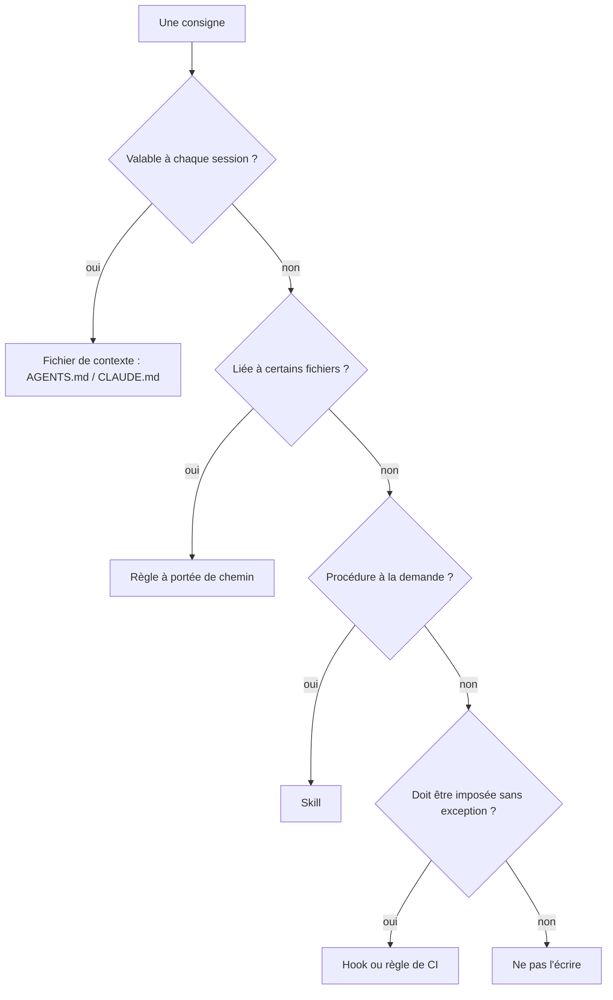

# Fichiers de contexte pour agents

## Aperçu

- Un **fichier de contexte** est un fichier Markdown versionné à la racine d'un dépôt, que l'agent de code lit au début de chaque session : commandes, conventions, pièges du projet.
- Il remplace ce qu'un humain apprend en deux semaines dans l'équipe, et qu'un agent, qui repart d'une fenêtre vide à chaque session, ne peut pas deviner.
- Son efficacité est moins évidente qu'annoncé : une étude de 2026 mesure un gain nul à marginal, et un surcoût de 19 à 23 %. Un fichier court, écrit à la main, vaut mieux qu'un fichier long et généré.

## Concepts clés

### Les formats

| Fichier | Outil | Remarque |
|---|---|---|
| `AGENTS.md` | format ouvert, lu par de nombreux agents | « simple, open format for guiding coding agents » ; sous la gouvernance de l'Agentic AI Foundation (Linux Foundation) |
| `CLAUDE.md` | Claude Code | peut importer d'autres fichiers par `@chemin` ; lit `AGENTS.md` seulement s'il n'y a aucun `CLAUDE.md` |
| `.clinerules/` | [[Cline]] | lit aussi `.cursorrules`, `.windsurfrules` et `AGENTS.md` |
| `.cursor/rules/` | Cursor | format à frontmatter ; `.cursorrules` est l'ancien format |
| `CONVENTIONS.md` | [[Aider]] | pas de nom imposé : chargé par `--read` ou `.aider.conf.yml` |

Le terrain converge vers `AGENTS.md` comme dénominateur commun. Pour un dépôt manipulé par plusieurs outils, la parade courante est un `AGENTS.md` unique, importé depuis le fichier propre à chaque outil plutôt que dupliqué : deux copies finissent par se contredire.

### Hiérarchie et priorité

- Un fichier par sous-dossier est permis (monorepo) : avec `AGENTS.md`, « le fichier le plus proche du fichier édité l'emporte », et la consigne explicite de l'utilisateur dans le chat prime sur tout.
- Les outils distinguent le fichier global de l'utilisateur, celui du projet et le fichier local non versionné. Un fichier local (préférences perso, URL de test) ne se commite pas.

### Où placer quoi

Un fichier de contexte est lu comme du **contexte, pas comme une configuration appliquée** : la documentation de Claude Code le dit en toutes lettres et renvoie vers un hook pour interdire une action. Une règle qui ne doit jamais être violée appartient à un hook, à un linter ou à la CI. Les procédures longues et occasionnelles relèvent des [[Agent skills]], chargés à la demande.

### Que mettre dedans

Ce qui ne se déduit pas du code, et ce que l'agent ne peut pas découvrir seul :

- les **commandes exactes** de build, de test, de lint et de démarrage (`uv run pytest -x`, pas « lancer les tests ») ;
- les **conventions qui s'écartent du standard** : gestionnaire de paquets imposé, format de message de commit, répertoire interdit ;
- les **pièges** : test lent à exclure, variable d'environnement obligatoire, service à démarrer avant ;
- l'**état de l'environnement** : on-prem sans accès Internet, miroir de paquets interne, proxy.

Ce qu'il vaut mieux omettre : la description de l'arborescence que l'agent lit en une commande, le résumé du README, les principes généraux (« écrire du code propre »).

### Ce que dit la mesure

L'étude de Gloaguen et al. (2026) compare des agents avec et sans fichier de contexte sur 138 tâches de 12 dépôts (AGENTbench) et sur SWE-bench :

- un fichier **généré par un LLM** fait baisser le taux de réussite d'environ 2 % et coûte 23 % de plus ;
- un fichier **écrit par les développeurs** apporte environ 4 % de réussite, pour environ 19 % de coût en plus ;
- les agents suivent bien les consignes (les outils cités sont utilisés 1,6 à 2,5 fois plus), mais ce surcroît d'exploration n'améliore pas le résultat ;
- les **aperçus du code** ne raccourcissent pas la recherche des fichiers pertinents ;
- un fichier généré n'aide un peu que lorsque README et docs sont retirés : il **double la documentation existante**.

Conclusion des auteurs : ne décrire que les exigences minimales (outillage spécifique) et mesurer avant de généraliser. Limite : l'étude porte sur des tâches de correction et d'ajout sur dépôts existants, pas sur des projets neufs ni sur des conventions d'équipe lourdes.

## En pratique

- **Écrire à la main, court.** La documentation de Claude Code vise moins de 200 lignes par fichier : au-delà, le fichier consomme du contexte et l'adhérence baisse. Ce chiffre est une consigne de l'éditeur, pas un résultat mesuré.
- **Le construire par les échecs** : à chaque fois que l'agent se trompe de commande ou casse une convention, ajouter une ligne ; à chaque ligne que l'agent respecte sans qu'on la lui ait donnée, la retirer.
- **Pas d'`/init` en pilote automatique.** Un fichier produit par la commande d'initialisation d'un outil se relit et se coupe, sinon c'est le cas « généré » de l'étude.
- **Pièges fréquents** : fichier trop long (les consignes importantes se noient), périmé (commande qui n'existe plus : l'agent la lance quand même), contradictoire (deux consignes opposées, l'agent en suit une au hasard), consigne impossible à tenir (« demander confirmation » dans une exécution sans humain). Relire le fichier à chaque changement d'outillage ; la documentation de Claude Code propose pour cela une commande d'audit.
- **Sur un projet on-prem ou ESN** : y consigner ce qui distingue le poste client du poste standard (pas de `pip install` direct, registre interne, interdictions contractuelles). Ce sont des informations qu'aucun modèle ne connaît.
- **Ne pas y mettre de secret.** Le fichier est versionné et lu par l'agent.
- **Style de sortie** : une consigne sur la forme des réponses (concision, pas de préambule) relève plutôt d'un skill, comme [[i-have-adhd]], que du fichier de projet.
- **Mémoire de session** : ce que l'agent apprend en travaillant se conserve ailleurs que dans ce fichier ; [[ai-memory]] consolide les sessions en pages Markdown versionnées et permet de changer d'outil en cours de tâche.

## Approches voisines & alternatives

- [[Context engineering]] — le cadre général : le fichier de contexte est la part du contexte qui est toujours chargée, donc la plus chère.
- [[Agent skills]] — la mémoire procédurale chargée à la demande ; à préférer au fichier de contexte pour tout ce qui n'est pas valable à chaque session.
- [[Agent memory]] — ce que l'agent retient d'une session à l'autre, par opposition à ce que l'humain écrit.
- [[ai-memory]] — brique : serveur MCP qui transforme les sessions en wiki Markdown, utile pour passer d'un outil à l'autre.
- [[i-have-adhd]] — brique : skill de discipline de sortie, exemple de consigne de forme qui sort du fichier de projet.
- [[Prompt engineering]] — la formulation d'une consigne, qui s'applique ligne à ligne dans ces fichiers.
- [[Développement piloté par la spécification]] — la spécification est un autre fichier lu par l'agent, mais propre à une fonctionnalité et non au dépôt.
- [[Agents de code]] — le hub des outils qui lisent ces fichiers.
- Alternative : **ne rien écrire** et laisser le dépôt parler (README, scripts de test, configuration de lint). Défendable si le projet est bien outillé, et c'est ce que suggère l'étude pour les aperçus.

## Pour aller plus loin

- agents.md (s. d.) — *AGENTS.md*, page du format : rôle, sections courantes, fichiers imbriqués, outils compatibles. Pas de date de lancement indiquée sur la page.
- Gloaguen, Mündler, Müller, Raychev, Vechev (2026) — *Evaluating AGENTS.md: Are Repository-Level Context Files Helpful for Coding Agents?*, arXiv:2602.11988.
- Anthropic (s. d.) — *How Claude remembers your project*, documentation de Claude Code : emplacements, imports, taille, cohérence, lecture d'`AGENTS.md`.
- Aider (s. d.) — *Specifying coding conventions* ; Cline (s. d.) — *Cline Rules* : emplacements et formats de leurs fichiers de règles.
