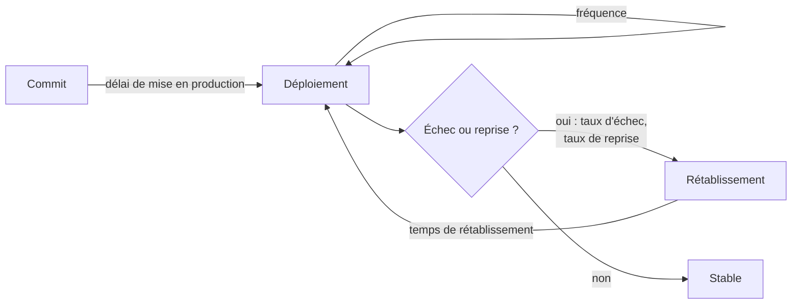

# Mesurer un projet - DORA, coût des agents et temps passé

## Aperçu

- Trois familles de mesures utiles à un projet de développement : la **santé de la livraison** (métriques DORA), le **coût des agents** (jetons et argent), le **temps passé** (humain).
- Mesurer sert à repérer où le projet s'enlise et à vérifier qu'un changement de pratique a aidé. Ce n'est pas un outil d'évaluation des personnes.
- Une mesure devenue objectif cesse d'être une bonne mesure (loi de Goodhart) : le choix des mesures compte autant que leur calcul.

## Concepts clés

### Les mesures DORA

DORA (DevOps Research and Assessment) publie depuis 2014 des mesures de la performance de livraison logicielle. Les « quatre clés » d'origine sont devenues **cinq mesures** en 2024, réparties en deux familles :

| Famille | Mesure | Ce qu'elle dit |
|---|---|---|
| Débit | Fréquence de déploiement | combien de déploiements sur une période |
| Débit | Délai de mise en production (*change lead time*) | du commit au déploiement en production |
| Débit | Temps de rétablissement après un déploiement raté (*failed deployment recovery time*) | durée pour revenir à la normale |
| Instabilité | Taux d'échec des changements (*change fail rate*) | part des déploiements qui exigent une intervention immédiate |
| Instabilité | Taux de reprise (*deployment rework rate*), ajouté en 2024 | part des déploiements imprévus causés par un incident en production |

Deux précisions d'historique tirées de dora.dev. Le « temps de rétablissement » s'appelait *mean time to recover* ; il a été renommé en 2023 pour ne compter que les échecs causés par un changement logiciel, pas une panne de centre de données. La **fiabilité** a été introduite en 2021 (elle remplaçait la « disponibilité » de 2018) : c'est une mesure de performance **opérationnelle**, à côté des mesures de livraison, pas l'une d'elles. Le rapport 2021 l'a présentée comme une « cinquième mesure », mais la cinquième mesure de livraison est bien le taux de reprise de 2024 (formulation relevée dans un résumé de la page d'historique, non relue mot à mot).

DORA avertit lui-même : les mesures s'appliquent **par application ou par service**, pas pour comparer des équipes ou des organisations ; fixer un objectif chiffré uniforme (« tout le monde déploie plusieurs fois par jour ») pousse à tricher.

### Le coût des agents

Une session d'agent de code consomme des **jetons** (entrée, sortie, cache) ; le coût en argent s'en déduit par le tarif du modèle, ou se lit comme une part d'un quota si l'abonnement est forfaitaire. Les outils lisent les journaux locaux de l'agent : ccusage agrège par jour, semaine, mois ou session, et suit les fenêtres de facturation de cinq heures ; [[Claude-Code-Usage-Monitor]] affiche la consommation en direct avec une prévision de rythme et des alertes avant la limite. Les deux sont sous licence MIT.

Deux usages distincts : **piloter le budget** (alerte avant la limite) et **comprendre** (quelles tâches coûtent cher, un contexte trop gros, une boucle qui tourne à vide). Le coût rapporté au résultat vaut mieux que le coût seul : un agent cher qui livre ce qui passe la revue peut coûter moins qu'un agent bon marché qu'il faut corriger.

### Le temps passé

ActivityWatch enregistre localement l'activité du poste (fenêtres, applications) ; les données restent chez l'utilisateur. Kimai est un suivi du temps auto-hébergeable (AGPL 3) : feuilles de temps, clients et projets, facturation, API JSON, authentification LDAP et SAML. Le premier se **déduit** de l'activité, le second se **déclare** ; ils ne répondent pas à la même question.

### Les mauvaises mesures

- **Lignes de code** : un agent en produit sans effort ; plus de lignes ne dit rien de plus de valeur, et supprimer du code est souvent le meilleur travail.
- **Nombre de commits** : mesure l'habitude de commit, pas l'avancement. Pire avec un agent.
- **Vélocité comparée entre équipes** : les points d'effort sont une unité locale, non transférable. Les comparer, c'est inciter à les gonfler.
- **Toute mesure d'activité utilisée comme note individuelle** : Goodhart, 1975 (« toute régularité statistique observée tend à s'effondrer dès qu'on la presse à des fins de contrôle »), repris par Strathern en 1997 : « quand une mesure devient un objectif, elle cesse d'être une bonne mesure ».

Les trois critiques ci-dessus sont celles de la pratique courante, plus que d'une source unique ; seule la mise en garde contre la comparaison d'équipes vient de DORA.

## En pratique

- **Solo** : l'équipe n'existe pas, donc DORA se réduit à deux lectures utiles, la fréquence de livraison et le temps de rétablissement, lisibles dans les tags et l'historique de la forge. Le coût des agents et le temps passé sont les vraies mesures : un tableau mensuel (jetons, argent, heures par projet) suffit.
- **Petite équipe** : mesurer par service, publier la tendance, ne jamais afficher un classement. Un outil comme [[Apache DevLake]] rassemble les données de la forge et de la CI (GitHub, GitLab, Jenkins, GitHub Actions) dans des tableaux DORA, auto-hébergeable par Docker Compose ou Kubernetes.
- **Où se trouvent les données** : Forgejo, GitLab CE et GitHub Actions portent déjà les dates de commit, de déploiement et d'échec de pipeline. Marquer proprement les releases et les incidents (voir [[Commits conventionnels, versions et changelog]]) rend le calcul possible sans outil de plus.
- **Avec des agents** : DORA 2025 (rapport sur le développement assisté par l'IA, près de 5 000 répondants) note que les équipes qui utilisent l'IA livrent plus de logiciel (retournement par rapport au rapport précédent) tout en gardant des difficultés de qualité avant livraison. Conséquence pratique : suivre ensemble le débit **et** l'instabilité ; une fréquence de déploiement qui monte avec un taux d'échec qui monte n'est pas un progrès.
- **On-prem industriel / ESN** : le client demande surtout du **temps** et de la **traçabilité** (qui a fait quoi, sur quel ticket, quelle version livrée), plus que DORA. Le temps facturable se tient dans un outil du type Kimai, hébergé chez le prestataire ou sur site ; la traçabilité vient des commits liés aux tickets et des releases taguées. Le temps d'un agent n'est pas du temps humain facturable : séparer les deux dans le reporting et dans le devis.
- **Pièges** : mesurer ce qui est facile plutôt que ce qui compte ; fixer un seuil chiffré (donc le contourner) ; suivre un agent à la lettre sans regarder la qualité de ce qu'il livre ; mettre en place un tableau de bord avant d'avoir une question à lui poser ; surveiller l'activité d'une personne par ActivityWatch sans son accord explicite — l'outil est conçu pour l'usage personnel.

## Approches voisines & alternatives

- [[Cycle de vie d'un projet assisté par agent]] — la mesure s'y insère à chaque phase ; le coût et le temps se lisent par phase.
- [[Revue, tests et définition de terminé avec un agent]] — la qualité de sortie qui rend le coût d'un agent interprétable.
- [[Commits conventionnels, versions et changelog]] — les tags et releases sont la source des dates de déploiement.
- [[Backlog, Kanban, Scrum et Shape Up]] — débit et vélocité y sont discutés ; le flux (Kanban) se rapproche du délai de mise en production.
- [[Agent evaluation]] — mesurer l'agent lui-même (réussite des tâches), distinct de mesurer le projet.
- [[Forgejo]] — forge auto-hébergée dont l'historique et les Actions fournissent les données de livraison.
- [[GitLab CE]] — idem ; ses pipelines donnent échecs et durées de déploiement.
- [[GitHub Actions]] — idem côté forge hébergée ; sa source de données pour DevLake.
- [[Forges & CI-CD]] — le hub où se trouvent les pipelines mesurés.
- Alternative : **ne rien mesurer d'automatique** et tenir un journal de bord manuel, suffisant en solo.

## Pour aller plus loin

- DORA, *DORA's software delivery metrics* — https://dora.dev/guides/dora-metrics/ (cinq mesures, mises en garde contre les objectifs et les comparaisons ; année du rapport non précisée sur la page).
- DORA, *History of DORA's software delivery metrics* — https://dora.dev/guides/dora-metrics/history/ (quatre clés 2014, fiabilité 2021, renommage 2023, taux de reprise 2024).
- Google, *How are developers using AI? Inside our 2025 DORA report* (23 septembre 2025) — https://blog.google/technology/developers/dora-report-2025/.
- Goodhart's law, Wikipédia (anglais) — https://en.wikipedia.org/wiki/Goodhart%27s_law (Goodhart 1975, Strathern 1997 ; source secondaire).
- ccusage — https://github.com/ryoppippi/ccusage (MIT) ; Claude-Code-Usage-Monitor — https://github.com/Maciek-roboblog/Claude-Code-Usage-Monitor (MIT).
- ActivityWatch, *Introduction* — https://docs.activitywatch.net/en/latest/introduction.html ; Kimai — https://www.kimai.org/ (AGPL 3) ; Apache DevLake — https://devlake.apache.org/.
