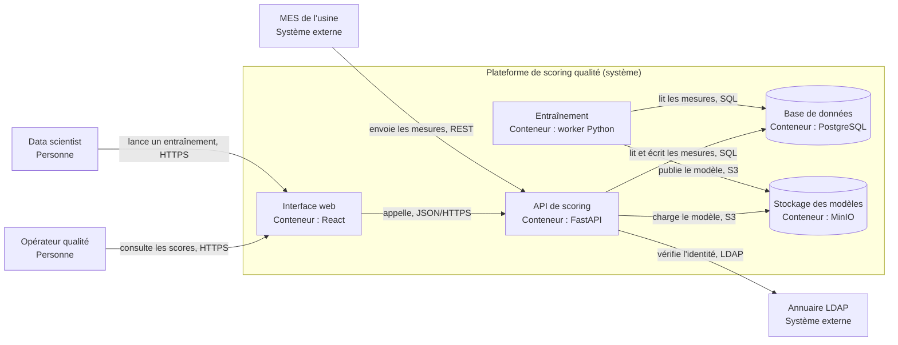

# Modèle C4

## Aperçu

- Le **modèle C4**, de Simon Brown, décrit l'architecture d'un logiciel à **quatre niveaux de zoom** : système (contexte), conteneurs, composants, code. Chaque niveau s'adresse à un public différent.
- C'est une manière de **découper et de nommer** ce qu'on dessine, pas une notation : le site officiel le dit « indépendant de la notation » et « indépendant des outils ».
- Il règle un défaut courant : le schéma d'architecture unique, où se mélangent services, bibliothèques, bases et utilisateurs au même niveau.

## Concepts clés

### Les quatre niveaux

| Niveau | Montre | Public |
|---|---|---|
| 1. **Contexte système** | le système comme une boîte, ses utilisateurs et les systèmes voisins | tout le monde, technique ou non |
| 2. **Conteneurs** | les applications et stockages de données qui composent le système | architectes, développeurs, exploitation |
| 3. **Composants** | les groupes de fonctionnalités à l'intérieur d'un conteneur | architectes, développeurs |
| 4. **Code** | classes, tables… d'un composant (UML, entité-relation) | développeurs |

Le site précise que les niveaux 1 et 2 **suffisent pour la plupart des équipes**. Le niveau 4 est déconseillé en documentation durable : un IDE le génère à la demande. Trois diagrammes complémentaires existent : paysage de systèmes, dynamique (séquence d'interactions) et déploiement.

### Un « conteneur » n'est pas Docker

Dans C4, un conteneur est **une application ou un magasin de données qui doit tourner** pour que le système fonctionne : application web, application mobile, base de données, fonction serverless, script. Le mot est volontairement générique. Brown regrette lui-même l'ambiguïté : beaucoup associent désormais « conteneur » à Docker. Un conteneur C4 peut correspondre à un conteneur Docker, ou à plusieurs, ou à aucun ; le déploiement relève du diagramme de déploiement.

Un **composant**, lui, vit **dans** un conteneur, dans le même processus, derrière une interface bien définie.

### Exemple : niveau 2 d'une plateforme de scoring qualité

Titre à porter sous le schéma : « Diagramme de conteneurs — Plateforme de scoring qualité ». Légende : rectangle arrondi = conteneur applicatif, cylindre = stockage de données, trait = relation orientée, étiquetée par son intention et son protocole.

### Notation

Les recommandations du site : un **titre** qui dit le type et le périmètre du diagramme ; une **légende** pour toute forme, couleur ou trait ; pour chaque élément, son **type** (personne, système, conteneur, composant), une description courte et, pour conteneurs et composants, la **technologie** ; des relations **orientées**, au libellé précis, en évitant le seul mot « utilise », avec le protocole pour les échanges entre processus. Les couleurs sont libres, à condition d'être cohérentes et lisibles (daltonisme, impression).

## En pratique

- **Commencer par le niveau 1, puis le niveau 2** ; ne descendre au niveau 3 que pour un conteneur qui le mérite. Un projet solo tient dans deux schémas.
- **Un modèle, pas des dessins** : le site distingue les outils de *modélisation* (un modèle structuré dont les diagrammes sont des vues) des outils de *dessin* (formes sans sémantique, éléments copiés-collés, formats difficiles à comparer). Un flowchart Mermaid, comme ci-dessus, relève du dessin : la convention C4 y est tenue à la main.
- **Versionner le texte** dans le dépôt (voir [[Diátaxis et docs-as-code]]) pour que le schéma suive le code et soit relu dans la même PR.
- Pour un projet on-prem, le niveau 1 met en évidence ce qui compte : les systèmes de l'industriel (MES, annuaire, historian) avec lesquels il faut s'intégrer, et ce qui ne sort pas du réseau.
- Avec des agents : un schéma C4 en texte est un **contexte dense** pour un agent ; un dépôt qui l'expose évite de lui faire redécouvrir la structure. Générer un schéma depuis le code (voir [[GitDiagram]]) donne un brouillon, à relire : le piège est de valider un schéma plausible mais faux.
- Pièges : confondre conteneur C4 et conteneur Docker ; mélanger les niveaux sur un même schéma ; flèches sans libellé ; oublier titre et légende ; schéma jamais mis à jour.

## Approches voisines & alternatives

- [[Mermaid]] — texte versionnable, rendu par GitHub et Obsidian ; la syntaxe `C4Context` existe mais est marquée expérimentale par la documentation Mermaid (« syntaxe et propriétés susceptibles de changer »), d'où le `flowchart` ci-dessus.
- [[Excalidraw]] — pour esquisser à main levée avant de formaliser.
- [[draw.io]] — éditeur graphique ; fichiers difficiles à comparer, mais bon pour un schéma stable.
- [[GitDiagram]] — génère un diagramme d'architecture depuis un dépôt GitHub ; brouillon à relire.
- [[Archify]] — skill d'agent pour produire des diagrammes d'architecture.
- [[Diagrammes]] — le hub des outils de schéma du brain.
- [[ADR et design docs]] — le schéma montre la structure, l'ADR explique pourquoi elle est ainsi.
- [[Diátaxis et docs-as-code]] — un schéma C4 relève de l'*explication* ; la page qui le porte vit dans le dépôt.
- [[Fichiers de contexte pour agents]] — y renvoyer le schéma de niveau 2.
- Outils en texte simple : Structurizr (DSL ; Structurizr se présente comme l'implémentation de référence du modèle, Apache-2.0 ; les anciens dépôts Lite et CLI sont archivés, remplacés par l'outillage unifié « local »), D2 (langage de diagrammes, MPL-2.0), PlantUML (LGPL-3.0), Kroki (MIT, service qui produit des images à partir de Mermaid, D2, PlantUML, Structurizr et d'autres formats). LikeC4 sera traité plus tard.

## Pour aller plus loin

- Simon Brown — *The C4 model for visualizing software architecture*, c4model.com (pages Diagrams, Container, Component, Code, Notation, Tooling ; site sous licence CC BY 4.0).
- Structurizr, github.com/structurizr/structurizr (états relevés le 2026-10-07).
- Documentation Mermaid, *C4 Diagram* (statut expérimental), mermaid.js.org/syntax/c4.html.
