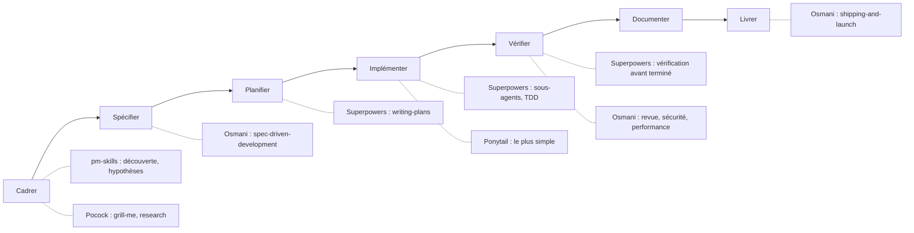

# Quel skill pour quelle étape

## Aperçu

- Un **skill précis** fait une chose à une étape donnée du cycle de vie. Cette page est celle qu'on ouvre pour choisir : l'étape, le besoin, le skill, le jeu qui le porte.
- Cinq jeux sont fichés dans le brain : [[Superpowers]], [[Skills d'Addy Osmani]], [[Skills de Matt Pocock]], [[Ponytail]] et [[pm-skills]]. Chacun a sa fiche, qui liste tous ses skills ; ici, un choix par besoin.
- Un jeu n'est pas à installer en bloc par défaut. Le mécanisme est décrit dans [[Agent skills]] ; le cycle qu'ils outillent, dans [[Cycle de vie d'un projet assisté par agent]].

## Concepts clés

### Les jeux en une ligne

| Jeu | Esprit | Taille | Licence |
|---|---|---|---|
| [[Superpowers]] | Une méthode complète, enchaînée, obligatoire | 15 skills | MIT |
| [[Skills d'Addy Osmani]] | Un catalogue large, une commande par étape | 25 skills, 9 commandes | MIT |
| [[Skills de Matt Pocock]] | Petits skills composables, interrogatoire d'abord | 31 skills | MIT |
| [[Ponytail]] | Une discipline : le moins de code possible | 1 skill, 5 commandes | MIT |
| [[pm-skills]] | Le produit en amont du code | 69 skills, 9 plugins | MIT |

Chiffres lus dans les dépôts le 2026-10-07 ; ils bougent à chaque version.

### Où ils interviennent

### Le tableau

Un skill par besoin, avec ses équivalents quand plusieurs jeux en portent un.

| Étape | Besoin | Skill | Jeu |
|---|---|---|---|
| Cadrer | Explorer le besoin avant de coder | `brainstorming` | Superpowers |
| Cadrer | Être interrogé jusqu'à ce que le plan soit clair | `grill-me` ; `interview-me` | Pocock ; Osmani |
| Cadrer | Transformer une idée floue en proposition | `idea-refine` | Osmani |
| Cadrer | Enquêter sur des sources primaires et garder le résultat cité | `research` | Pocock |
| Cadrer | Tester des hypothèses de produit, préparer des entretiens | `identify-assumptions-*`, `opportunity-solution-tree`, `interview-script` | pm-skills |
| Cadrer | Écrire la barre de qualité du projet | `constraint-driven-development` | Osmani |
| Spécifier | Écrire un PRD | `create-prd` ; `spec-driven-development` | pm-skills ; Osmani |
| Spécifier | Rédiger des histoires d'utilisateur | `user-stories`, `job-stories`, `wwas` | pm-skills |
| Spécifier | Tirer une spécification de la conversation en cours | `to-spec` | Pocock |
| Spécifier | Tenir un glossaire du domaine et ses ADR | `grill-with-docs`, `domain-modeling` | Pocock |
| Planifier | Un plan en tâches de quelques minutes | `writing-plans` ; `planning-and-task-breakdown` | Superpowers ; Osmani |
| Planifier | Des tickets avec leurs dépendances | `to-tickets` | Pocock |
| Planifier | Un chantier plus gros qu'une session | `wayfinder` | Pocock |
| Planifier | Prioriser un backlog, bâtir une feuille de route ou un sprint | `prioritize-features`, `prioritization-frameworks`, `outcome-roadmap`, `sprint-plan` | pm-skills |
| Planifier | Isoler le travail sur une branche | `using-git-worktrees` | Superpowers |
| Planifier | Trouver où approfondir l'architecture | `improve-codebase-architecture` | Pocock |
| Implémenter | Un sous-agent par tâche, relu deux fois | `subagent-driven-development` ; `implement-spec` | Superpowers ; Pocock |
| Implémenter | Exécuter le plan dans une seule session | `executing-plans` ; `implement` ; `incremental-implementation` | Superpowers ; Pocock ; Osmani |
| Implémenter | Lancer des agents en parallèle sur des tâches indépendantes | `dispatching-parallel-agents` | Superpowers |
| Implémenter | Test d'abord | `test-driven-development` ; `tdd` | Superpowers, Osmani ; Pocock |
| Implémenter | Garder le code simple | `ponytail` ; `code-simplification` | Ponytail ; Osmani |
| Implémenter | Appuyer chaque choix sur la documentation officielle | `source-driven-development` | Osmani |
| Implémenter | Concevoir une API, des modules | `api-and-interface-design` ; `codebase-design` | Osmani ; Pocock |
| Implémenter | Répondre à une question de conception par un prototype jetable | `prototype` | Pocock |
| Implémenter | Donner le bon contexte à l'agent | `context-engineering` ; `writing-for-agents` | Osmani ; Pocock |
| Vérifier | Déboguer jusqu'à la cause racine | `systematic-debugging` ; `diagnosing-bugs` ; `debugging-and-error-recovery` | Superpowers ; Pocock ; Osmani |
| Vérifier | Exiger une preuve avant d'annoncer « terminé » | `verification-before-completion` | Superpowers |
| Vérifier | Relire le code écrit par l'agent | `requesting-code-review` ; `code-review` ; `code-review-and-quality` | Superpowers ; Pocock ; Osmani |
| Vérifier | Chasser la sur-ingénierie dans un diff ou un dépôt | `ponytail-review`, `ponytail-audit` | Ponytail |
| Vérifier | Contester une décision en contexte neuf | `doubt-driven-development` | Osmani |
| Vérifier | Tester une interface dans un navigateur | `browser-testing-with-devtools` ; `webapp-testing` | Osmani ; Anthropic |
| Vérifier | Sécurité, performance | `security-and-hardening`, `performance-optimization` | Osmani |
| Vérifier | Scénarios de test depuis des histoires ; risques avant lancement | `test-scenarios` ; `pre-mortem`, `strategy-red-team` | pm-skills |
| Documenter | Décisions d'architecture, documentation d'API | `documentation-and-adrs` | Osmani |
| Documenter | Rétro-documenter une application écrite à la volée | `shipping-artifacts`, `intended-vs-implemented` | pm-skills |
| Documenter | Rédiger une spécification ou un document de décision à plusieurs | `doc-coauthoring` | Anthropic, voir plus bas |
| Livrer | Terminer une branche : tests, fusion, PR, nettoyage | `finishing-a-development-branch` | Superpowers |
| Livrer | Commits atomiques, tronc commun | `git-workflow-and-versioning` | Osmani |
| Livrer | Corps de pull request avec preuves et risque de fusion | `pr` | Pocock |
| Livrer | Pipelines à portes de qualité | `ci-cd-and-automation` | Osmani |
| Livrer | Lancement, retour arrière, supervision | `shipping-and-launch`, `observability-and-instrumentation` | Osmani |
| Livrer | Notes de version | `release-notes` | pm-skills |
| Livrer | Retirer ou migrer un ancien système | `deprecation-and-migration` | Osmani |
| Après | Rétrospective, améliorations de l'environnement de l'agent | `retro` | Pocock ; pm-skills |
| Après | Passer le relais à un autre agent | `handoff` | Pocock |
| Après | Retrouver les raccourcis laissés | `ponytail-debt` | Ponytail |
| Autour | Créer, tester et mesurer un skill | `skill-creator` ; `writing-skills` | Anthropic ; Superpowers |
| Autour | Construire un serveur MCP | `mcp-builder` | Anthropic |
| Autour | Comprendre pourquoi un skill n'a pas déclenché | `diagnosing-superpowers` | Superpowers |
| Autour | Savoir quel skill existe | `ask-matt` ; `using-agent-skills` | Pocock ; Osmani |

### Les quatre skills d'Anthropic

Le dépôt `anthropics/skills` n'a pas de licence à la racine : chaque skill porte la sienne. Relevé le 2026-10-07, skill par skill :

| Skill | Ce qu'il fait | Licence relevée |
|---|---|---|
| `skill-creator` | Crée un skill, le fait évoluer, mesure ses performances | Apache-2.0 (`LICENSE.txt`) |
| `mcp-builder` | Guide de construction d'un serveur MCP, en Python (FastMCP) ou Node/TypeScript | Apache-2.0 (`LICENSE.txt`) |
| `webapp-testing` | Teste une application web locale avec Playwright (captures, journaux) | Apache-2.0 (`LICENSE.txt`) |
| `doc-coauthoring` | Rédige une spécification ou un document de décision en trois temps : contexte, structure, test par un lecteur | **Aucune licence trouvée** : ni `LICENSE.txt`, ni champ `license` |

Les trois premiers s'installent par le plugin `example-skills` du marché `anthropics/skills`, qui regroupe douze skills. `doc-coauthoring` y figure aussi : faute de licence libre confirmée, il est cité ici en texte simple, sans lien d'installation, et reste hors de ce que le brain recommande. Le README du dépôt précise que les skills `docx`, `pdf`, `pptx` et `xlsx` sont **source-available**, non libres : hors de cette page.

## En pratique

- **Un jeu, ou quelques skills choisis, pas trois jeux.** `test-driven-development` existe chez Superpowers et chez Osmani, `tdd` chez Pocock : des descriptions qui se recouvrent rendent le déclenchement aléatoire (voir [[Agent skills]]). C'est une déduction à partir de ce mécanisme, non une mesure.
- **Partir de l'étape qui bloque**, pas du catalogue : l'agent ne comprend pas ce qu'on veut → `grill-me` ; le code est trop gros → `ponytail` ; on ne sait pas si c'est fini → `verification-before-completion`.
- **Un cycle imposé ou un catalogue à la carte.** Superpowers enchaîne ses skills et les rend obligatoires ; Osmani et Pocock laissent choisir. Pour un projet solo, la carte souple coûte moins de cérémonie ; pour une équipe qui veut un même rythme, le cycle imposé.
- **Un skill n'est pas une règle appliquée.** Il est lu comme du contexte. Ce qui ne doit jamais être violé relève d'un hook ou de la CI, comme le dit [[Fichiers de contexte pour agents]].
- **Mesurer.** Les gains annoncés (−54 % de code pour Ponytail) sont ceux de leur auteur, sur un modèle et un dépôt donnés. Voir [[Mesurer un projet - DORA, coût des agents et temps passé]].
- **On-prem ou ESN** : ces jeux s'installent depuis GitHub ou un marché de plugins. Un poste client sans accès sortant demande de rapatrier les dépôts ; les skills sont des fichiers Markdown, donc relisables et auditables avant usage.
- **Pièges** : un skill tiers non relu est du texte que l'agent exécute ; `git-guardrails-claude-code` (Pocock) bloque `git push`, ce qui gêne un flux de petits commits poussés ; `setup-pre-commit` (Pocock) installe Husky, pas le [[pre-commit]] de l'écosystème Python.

Pas de page pour `everything-claude-code`, `wshobson/agents` et `awesome-copilot` : des collections trop larges pour un choix par étape. Les annuaires de skills sont traités à part.

## Approches voisines & alternatives

- [[BMAD]] — un jeu d'agents et de workflows qui couvre tout le cycle avec des rôles nommés ; plus lourd qu'un skill précis.
- [[Spec Kit]] — la spécification exécutable, de la constitution à l'implémentation.
- [[i-have-adhd]] — un skill de forme de sortie, sans lien avec une étape du cycle.
- [[Agent skills]] — le mécanisme : description chargée en continu, corps chargé à la demande.
- [[Fichiers de contexte pour agents]] — `AGENTS.md` et `CLAUDE.md`, pour ce qui vaut à chaque session ; les skills, pour ce qui vaut à une étape.
- [[Développement piloté par la spécification]], [[PRD et user stories]], [[Revue, tests et définition de terminé avec un agent]], [[Boucle de Ralph]] — les méthodes que ces skills outillent.
- [[Agents de code]] — le hub des agents qui les hébergent.

## Pour aller plus loin

- obra (consulté le 2026-10-07) — *Superpowers*, README et liste des skills, dépôt `obra/superpowers`, v6.4.2.
- Osmani (consulté le 2026-10-07) — *Agent Skills*, README : commandes, 25 skills, personas, listes de contrôle, dépôt `addyosmani/agent-skills`, 0.6.12.
- Pocock (consulté le 2026-10-07) — *Skills For Real Engineers*, README : les quatre échecs et les skills qui y répondent, dépôt `mattpocock/skills`, v1.3.1.
- Gebert (consulté le 2026-10-07) — *Ponytail*, README : l'échelle, les commandes, la méthode de mesure, dépôt `DietrichGebert/ponytail`, v4.13.0.
- Huryn (consulté le 2026-10-07) — *PM Skills Marketplace*, README : plugins, skills, commandes, dépôt `phuryn/pm-skills`, v2.1.0.
- Anthropic (consulté le 2026-10-07) — *anthropics/skills*, README et `LICENSE.txt` de chaque skill.
