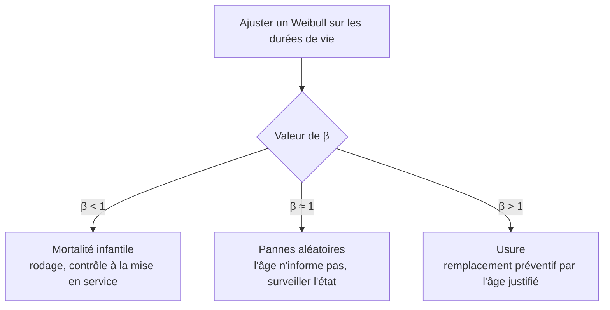

# Loi de Weibull

## Aperçu

- La loi de Weibull décrit **combien de temps une machine tient avant de tomber en panne**. Elle tient en deux nombres : une **forme** $\beta$ et une **échelle** $\eta$. La forme dit si le risque de panne **monte, baisse ou reste plat** avec l'âge ; l'échelle dit à quel âge la flotte est déjà bien entamée.
- C'est le modèle de durée de vie le plus courant en fiabilité industrielle, parce que le seul paramètre $\beta$ couvre les trois régimes de panne classiques (mortalité infantile, pannes aléatoires, usure). La page sert de **porte d'entrée** : la mécanique de survie complète est dans [[Analyse de survie]], et l'usage pour prédire une durée de vie résiduelle dans [[RUL par analyse de survie]].
- Exemple d'usine : un lot de roulements de pompes, 40 pannes observées. Un Weibull ajusté dit « $\beta\approx3$ » : le risque de panne **grimpe avec l'âge**, donc remplacer un roulement avant l'usure a un sens. Si le même ajustement disait $\beta\approx1$, un remplacement par l'âge ne servirait à rien.

## Concepts clés

### La forme $\beta$ : trois régimes de panne

- $\beta<1$ : le risque **baisse** avec l'âge. Les machines fragiles tombent tôt (défaut de fabrication, de montage), celles qui passent le cap sont solides. On parle de mortalité infantile.
- $\beta=1$ : le risque est **constant**. La loi devient exponentielle (NIST) : une machine d'un an n'est pas plus à risque qu'une neuve. Les pannes arrivent au hasard (choc, surcharge, erreur de manipulation).
- $\beta>1$ : le risque **monte** avec l'âge. C'est l'usure : fatigue, corrosion, encrassement. Plus $\beta$ est grand, plus les pannes se concentrent autour de $\eta$.

### L'échelle $\eta$ : la « vie caractéristique »

- $\eta$ est l'âge auquel **63,2 %** de la flotte est déjà tombée en panne, quelle que soit la forme : $F(\eta)=1-e^{-1}$. Le NIST l'appelle *characteristic life*.
- Quand $\beta=1$, $\eta$ est la durée moyenne avant panne (MTTF). Sinon la moyenne vaut $\eta\,\Gamma(1+1/\beta)$, à ne pas confondre avec $\eta$ (voir [[Indicateurs de fiabilité (MTBF, MTTR, disponibilité)]]).

### La courbe en baignoire

- Une machine réelle traverse souvent trois phases : un risque qui baisse au début, un plateau, puis un risque qui remonte à l'usure. C'est la **courbe en baignoire**.
- **Un seul Weibull n'en décrit qu'une phase** : $\beta$ est unique. Pour toute la vie d'un équipement, il faut un modèle par phase ou un mélange. Un ajustement sur des machines toutes en phase d'usure donnera $\beta>1$ même si les premiers mois étaient fragiles.

### Les pannes qui n'ont pas eu lieu (censure)

- Dans une flotte réelle, la plupart des machines **tournent encore** à la date de l'analyse. Les écarter, ou les compter comme « panne à l'âge actuel », fausse $\beta$ et $\eta$. Il faut un ajustement par vraisemblance qui tient compte de la **censure**, comme celui de [[lifelines]] (`WeibullFitter`).

## Les maths, simplement

- Probabilité d'être encore en marche à l'âge $t$ (survie) : $S(t)=\exp\!\big(-(t/\eta)^{\beta}\big)$. Probabilité d'avoir déjà lâché : $F(t)=1-S(t)$.
- Risque instantané de panne, sachant qu'on a tenu jusque-là : $h(t)=\dfrac{\beta}{\eta}\Big(\dfrac{t}{\eta}\Big)^{\beta-1}$. L'exposant $\beta-1$ est négatif, nul ou positif : c'est ce qui donne les trois régimes (formules du NIST, avec ses notations $\gamma$ pour la forme et $\alpha$ pour l'échelle).
- Âge de la fraction $p$ de pannes (la vie « B10 » pour $p=0{,}10$) : $t_p=\eta\,\big(-\ln(1-p)\big)^{1/\beta}$.
- **Exemple chiffré** (valeurs choisies pour l'exemple, calculs de cette page) : $\beta=3$, $\eta=8\,000$ h pour un roulement.
  - Risque à 2 000 h : $\tfrac{3}{8000}\,(0{,}25)^{2}\approx 2{,}3\times10^{-5}$ par heure. À 6 000 h : $\tfrac{3}{8000}\,(0{,}75)^{2}\approx 2{,}1\times10^{-4}$ par heure. Le risque est **9 fois plus haut**.
  - Probabilité de tenir 6 000 h : $\exp(-0{,}75^{3})\approx 0{,}66$.
  - Vie B10 : $8000\times(-\ln 0{,}9)^{1/3}\approx 3\,780$ h. Moyenne : $8000\times\Gamma(4/3)\approx 7\,140$ h.
- **Papier de Weibull.** En passant au double logarithme, $\ln(-\ln S(t))=\beta\ln t-\beta\ln\eta$ : des durées de vie qui suivent un Weibull s'alignent sur une droite de pente $\beta$ quand on trace $\ln(-\ln S)$ contre $\ln t$. C'est le test visuel historique.

## En pratique

- **Commencer par regarder $\beta$.** Ajuster sur la flotte (avec les machines encore en marche comme censurées), lire $\beta$ : c'est lui qui dit si l'âge est utile. Le même réflexe est écrit dans [[RUL par analyse de survie]].
- **$\beta\le1$ → l'âge n'aide pas.** Le risque n'augmente pas, un remplacement préventif à date fixe jette de la vie utile. La surveillance de l'état ([[Surveillance conditionnelle et modes de défaillance]], [[Indicateurs de santé]]) prend le relais. Le coût comparé des politiques est dans [[Politique de maintenance et coût]].
- **Un Weibull sur l'âge seul ne voit pas la condition de la machine** : deux pompes du même âge ont la même prédiction, qu'elles vibrent ou non. Pour tenir compte des capteurs, passer à un modèle à covariables ([[RUL par analyse de survie]]).
- **Mélange de modes de défaillance.** Si une machine casse de deux façons (roulement, joint), un Weibull unique sur « toutes les pannes » mélange deux $\beta$ et ne vaut aucun des deux. Séparer par mode quand les données le permettent.
- **Peu de pannes observées** : les estimations de $\beta$ sont très incertaines, il faut des intervalles de confiance ([[Intervalles de confiance]]) et se rappeler que peu de pannes ne dit rien de la queue de la loi ([[Maintenance prédictive avec peu de pannes]]).
- **Weibull est empirique** : il s'ajuste bien, il n'explique pas pourquoi. Un bon ajustement ne prouve pas que la physique de l'usure suit cette loi.

## Approches voisines & alternatives

- [[Analyse de survie]] — le cadre général (Kaplan-Meier, Cox) qui n'impose aucune forme de loi ; Weibull en est la variante paramétrique.
- [[RUL par analyse de survie]] — l'usage de Weibull pour estimer la durée de vie résiduelle, avec les modèles à covariables.
- [[lifelines]] — la bibliothèque Python : `WeibullFitter`, `WeibullAFTFitter`.
- [[Théorie des valeurs extrêmes]] — la famille de lois des extrêmes ; la loi de Weibull y apparaît comme la loi limite des minima bornés (cf. cette page pour le cadre précis).
- [[Maintenance prédictive et RUL]] et [[Politique de maintenance et coût]] — où la valeur de $\beta$ change une décision.
- [[Indicateurs de fiabilité (MTBF, MTTR, disponibilité)]] — MTBF et disponibilité, qui supposent souvent un risque constant ($\beta=1$).

## Pour aller plus loin

- NIST/SEMATECH e-Handbook of Statistical Methods, §8.1.6.1, *Weibull* (lu : définitions, risque, rôle de $\gamma$, vie caractéristique) : https://www.itl.nist.gov/div898/handbook/apr/section1/apr162.htm
- Weibull (1951), *A statistical distribution function of wide applicability*, Journal of Applied Mechanics 18, 293-297 (référence confirmée par recherche, texte non relu) : https://jhanley.biostat.mcgill.ca/bios601/CHchapters040506/Weibull-ASME-Paper-1951.pdf
- Documentation lifelines, `WeibullFitter` : https://lifelines.readthedocs.io/en/latest/fitters/univariate/WeibullFitter.html (lien repris de [[RUL par analyse de survie]])
